# Wizardry I: Proving Grounds of the Mad Overlord — 繁體中文化專案
（巫術 I：瘋王試煉場）

> *Wizardry: Proving Grounds of the Mad Overlord*（巫術 I：瘋王試煉場，1981，Sir-tech 賽爾科技）
> ✦ 全新 C++17 跨平台重寫 + 全中文化
> ✦ 基於 [snafaru/Wizardry.Code](https://github.com/snafaru/Wizardry.Code) v3.2 的 UCSD Pascal（加州大學聖地牙哥分校 Pascal）源碼
> ✦ SDL2（Simple DirectMedia Layer）+ Noto Sans CJK TC（思源黑體繁中）✦ 1280×720 自由排版 ✦ Eye-of-Map 自動繪圖（迷宮之眼）

---

## 目錄

1. [一句話說清楚](#hero)
2. [快速開始](#quick-start)
3. [為何要漢化 Wizardry？](#why)
4. [八紀變遷 — Wizardry 系列大歷史](#eight-eras)
5. [八職代數美 — 4 基職 + 4 進階職的代數結構](#class-algebra)
6. [Lingua Magica — 巫術四音節咒語體系](#lingua-magica)
7. [瘋王試煉場 — B1F〜B10F 地下迷宮](#dungeon)
8. [實機截圖展示](#screenshots)
9. [台灣 Apple II 老玩家的記憶](#taiwan-1985)
10. [snafaru v3.2 — 45 年後的 100 項修正](#v32-fixes)
11. [1991 OVA 動畫致敬](#ova)
12. [Technical Deep Dive](#technical-deep-dive)
13. [📚 中文百科](#knowledge-base)
14. [License & Credits](#credits)

---

<a name="hero"></a>
## 🧙 Wizardry I 繁體中文版 — 用母語走進瘋王試煉場

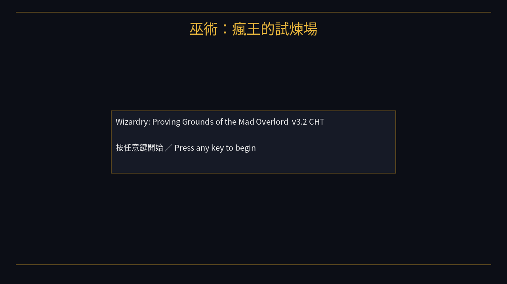
*1981 年 RPG 之祖，2026 年以中文重新開機。*

這是 **Wizardry: Proving Grounds of the Mad Overlord (1981)** 的完整繁體中文化版本——
不是 emulator + patch，而是用 C++ 從 snafaru 的 UCSD Pascal 源碼**重寫**，跨 Linux / Windows，
保留 v3.2 全部 100+ 規則修正，並把 UI 從 Apple II 的 40 column ASCII 升級到 1280×720 全中文 TTF 介面。

| 項目 | 狀態 |
|------|------|
| 全部里程碑 (M1~M8) | **8 / 8 完成** |
| v0.2 城鎮系統 | 訓練場 / 商店 / 旅館 / 神殿 全部 done |
| v0.3 進階功能 | 酒館編隊 / 戰鬥法術 / **Eye-of-Map** / Camp 存檔 done |
| v0.4 美術升級 | **55 個 PCE-CD 怪物立繪** (CC-BY-SA from wizardry.wiki.gg) |
| v0.5 手冊對校 | Roller lore tooltip + Inn 房型對齊 Sir-tech 手冊 |
| **v0.6 法術完整** | **全 51 咒語接 effect**（HALITO ~ TILTOWAIT，含 v3.2 修正） |
| v0.7 W6 .pic 研究 | docs/W6_PIC_FORMAT.md 格式分析筆記 |
| v0.8 Apple II LZ（Lempel-Ziv 1977 字典式壓縮，原版用來壓 title 畫面） | LZDECOMP + HGR（Apple II 高解析繪圖緩衝區）→PNG Python toolchain |
| **v0.9 翻譯** | **100% 中文化**（453/453 keys，含原版版權聲明逐條中譯） |
| **v1.0 CI** | **GitHub Actions Linux + Windows matrix，自動 release** |
| **v1.1 Sprite 對應** | **60 個 PCE-CD sprite bundled，29/30 怪物有專屬立繪** |
| **v1.2 Camp 法術** | **11 個 out-of-combat 咒語**（DIOS/MADI/DUMAPIC/MILWA/DI...） |
| **v1.3 BGM** | **SDL_mixer + Kevin MacLeod CC-BY 4 軌**（title/town/maze/combat） |
| **v1.4 Sprite 全齊** | **30/30 怪物有 PCE-CD 立繪** + snapshot 視覺驗證工具 |
| v1.5 視覺驗證 | docs/v15_all_30_sprites.png — 全 30 隻 in-game 拼貼 |
| **v1.6 SFX** | **11 個程序生成音效**（攻擊/法術/腳步/選單/開門...） |
| **v1.11 多 slot 存檔** | **5 槽位**，標題畫面 1–5 鍵直接讀檔 + Camp 槽位選擇器 |
| **v1.11 GitHub Pages** | [文件站上線](https://wicanr2.github.io/wizardry-1-cht/)，Cayman theme |
| **v1.12 F3 主題切換** | **PCE-CD / Mono / Outline / Sepia** + 各 theme 可獨立 BGM |
| **v1.13 規則 gap fix** | Poisoned 狀態（tick 扣血/Castle 解毒）+ 沉睡/麻痺 gating + 前/後排陣型 |
| **v1.14 迷宮陷阱** | **4 種陷阱**：Pit / Spinner / Teleporter / Chute 全部生效 |
| **v1.14 轉職系統** | Camp [X] 鍵 — 8 職業屬性 + 陣營雙重檢核 |
| **v1.15 F4 多語** | **繁中 / English / 日本語** 全局即時切換 |
| **v1.16 多層迷宮** | **10 層 B1F-B10F**，[原版地圖](https://wicanr2.github.io/wizardry-1-cht/MAPS.html)轉錄完成 |
| **v1.16 永久死亡** | 戰死屍體留在迷宮，需新隊伍走回原格拾取 |
| **v1.17 神殿復活** | DI（亡→生）+ KADORTO（灰→生）含失敗風險與 Status::Lost 終局 |
| **v1.18 日文化完成** | **453/453 UI 條目全部補上 ja_JP 欄位**（F4 三語切換 100% 涵蓋） |
| **v1.19 遭遇率對齊** | per-step `enmy_calc[0]` formula `30 + 7*(L-1)` clamp 110 — B1F ~12% / B10F ~43%，B1F 走完 smoke test |
| **v1.20 主題深化** | F3 切換時迷宮牆/門/地板/天花板/自動地圖**全部跟著換色**；標題背景也走 theme-aware fallback；UI chrome 字串改走 tr() |
| **v1.21 戰鬥真實感** | 突襲回合（先發/被突襲）+ 吸血鬼吸等級 + 食屍鬼麻痺 + 龍類吐息（vit-save 半傷）|
| **v1.22 缺口收束** | 法術槽自動補滿/扣除（Mage/Priest/Bishop 延遲）+ Afraid +2 AC + 神殿解咒 + 完整 8 種陷阱 + CALFO/LATUMAPIC 真正生效 |
| **v1.23 P2 polish** | M 鍵自動地圖開關 + 北/東/南/西 + 深度指北針 + Shift+↑↓ 隊伍重排 + Camp 匯出角色卡 + Dark zone（無光僅見 1 格） |
| 法術 / 怪物 / 道具表 | 51 法術 + 30 怪物 + 30 道具，含中文名 |
| 單元測試 | **14 / 14 ctest 全綠**（含 v13 mechanics + class_change + special_attacks + spell_slots） |
| 平台 | Linux x86_64 / Windows 10+ |
| 字型 | Noto Sans CJK TC（思源黑體繁中，OFL 1.1 開源字型授權 / SIL Open Font License，可打包） |
| GitHub | [wicanr2/wizardry-1-cht](https://github.com/wicanr2/wizardry-1-cht) |
| 📖 文件站 | [wicanr2.github.io/wizardry-1-cht](https://wicanr2.github.io/wizardry-1-cht/) — 怪物 / 法術 / 道具 / 攻略 / 開發史 8 篇繁中知識庫 |

---

<a name="quick-start"></a>
## ⚡ 快速開始

[](https://github.com/wicanr2/wizardry-1-cht/actions/workflows/build.yml)
[](https://github.com/wicanr2/wizardry-1-cht/actions/workflows/sanity.yml)
[](https://github.com/wicanr2/wizardry-1-cht/releases/latest)

### 下載

**[📦 最新 Release](https://github.com/wicanr2/wizardry-1-cht/releases/latest)** 包含完整 v1.23 功能集（10 層原版迷宮 + 神殿復活 + 法術槽 + 完整陷阱 + 主題化 BGM/迷宮牆色 + F4 三語切換 + 暗黑區域 + 角色卡匯出）：
- 🐧 `wizardry-cht-linux.tar.gz` (Linux x86_64, ~435 KB)
- 🪟 `wizardry-cht-windows.zip` (Windows x64, ~425 KB)

含全 30 隻 PCE-CD 怪物立繪、F1 操作說明、11 個音效、100% 中文化。背景音樂（4 軌, ~17 MB）由 `tools/fetch_music.sh` 抓。

或從源碼編譯：

### 依賴

- C++17 編譯器（gcc 11+ / clang 14+ / MSVC 19.30+）
- CMake 3.16+
- SDL2 / SDL2_ttf / SDL2_image
- nlohmann/json (optional)

### Linux (Ubuntu 22.04+)

```bash
# 安裝 SDL2 系列開發套件、CMake、編譯工具與 JSON 函式庫
sudo apt-get install libsdl2-dev libsdl2-ttf-dev libsdl2-image-dev \
                     cmake build-essential nlohmann-json3-dev

git clone https://github.com/wicanr2/wizardry-1-cht.git
cd wizardry-1-cht
cmake -B build                  # 在 build/ 目錄生成編譯設定
cmake --build build -j          # -j 多執行緒平行編譯
ctest --test-dir build          # 跑單元測試（共 14 條）
./build/src/wizardry_cht        # 啟動遊戲
```

### Windows

```powershell
# 用 vcpkg 套件管理器安裝相依函式庫
vcpkg install sdl2 sdl2-ttf sdl2-image nlohmann-json
# 指定 vcpkg 的 CMake toolchain 檔，讓 CMake 找得到函式庫
cmake -B build -DCMAKE_TOOLCHAIN_FILE=%VCPKG_ROOT%/scripts/buildsystems/vcpkg.cmake
cmake --build build --config Release
build\src\Release\wizardry_cht.exe
```

### 操作

| 場景 | 鍵位 |
|---|---|
| 標題畫面 | 任意鍵開始 |
| 城鎮邊緣 | `C` 城堡 / `T` 訓練場 / `M` 迷宮 / `L` 離開 |
| 城堡 | `G` 酒館 / `A` 旅館 / `B` 商店 / `C` 神殿 / `E` 邊緣 |
| 商店 / 旅館 / 神殿 | Tab 切換顧客  ↑↓ 選項  Enter / 字母 操作  ESC 離開 |
| 酒館 | Tab 切換名冊/隊伍  `A` 加入  `R` 移除 |
| 訓練場（Roller） | 名字→種族→陣營→屬性→紅利點→職業（8 步） |
| 迷宮 | W/↑ 前進  S/↓ 後退  A/← 左轉  D/→ 右轉  Space 觸發戰鬥  ESC 出去 |
| 戰鬥 | `F` 攻擊  `S` 法術  `P` 防禦  `R` 全隊逃跑 |

---

<a name="why"></a>
## ✨ 為何要漢化 Wizardry？

1981 年，紐約康乃爾大學的兩個學生 **Andrew Greenberg** 和 **Robert Woodhead** 把他們玩 D&D（Dungeons & Dragons，龍與地下城桌上角色扮演遊戲）的回憶，
寫成了 Apple II（蘋果二號電腦，1977 年 Steve Wozniak 設計的 8 位元家用電腦）上的 *Wizardry: Proving Grounds of the Mad Overlord*。

那是一個沒有彩色貼圖、沒有音樂、只有 40 column（每行 40 字元）文字加幾條 HGR（High-Resolution Graphics，Apple II 的 280×192 高解析繪圖模式）線條的時代。
但這個遊戲做了一件後來影響整個產業 45 年的事——**它讓你扮演的不是一個英雄，而是一個會永遠死亡的小隊**。
一個 1 級魔法師被 Murphy's Ghost（墨菲之鬼，B1F 隨機遭遇的單體靈體）一拳打死，就**真的死了**——磁片上的角色檔被覆寫，灰飛煙滅。

這份「無存檔可救」的殘酷，加上六人小隊、第一人稱 3D 迷宮、四音節咒語——
**整個 JRPG 類型**（Dragon Quest 1986、Final Fantasy 1987）都是踩在 Wizardry 的肩膀上長大的。
日本玩家對 Wizardry 的崇拜程度遠超北美，**Wizardry Online 在日本一直營運到 2010 年代**。

1985 年前後，台灣的 Apple II 玩家也玩到了這片磁碟。那個年代沒有攻略網站、沒有 Wiki、
甚至連中文版的怪物名都靠口耳相傳。*Bushwhacker* 該叫什麼？*Bubbly Slime* 翻成什麼？
*Werdna's Amulet* 到底是什麼？四十年來，**Wizardry I 從來沒有過正式的繁體中文版**。

> *「四十五年後，這個專案想做的事很簡單：讓 2026 年的中文玩家，可以用母語走進 Boltac 的商店，跟 Gilgamesh 的酒館老闆討論今天該帶誰下迷宮，然後在 B10F 找到 Werdna 的護身符。」*

---

<a name="eight-eras"></a>
## 📜 八紀變遷 — Wizardry 系列大歷史

Wizardry 系列共有 **8 部主線** + 數十款日系外傳，跨度 45 年。

### 第一紀：Mad Overlord 三部曲（1981–1983）

由 **Sir-tech**（賽爾科技軟體，總部設於美國紐約 Ogdensburg，後遷加拿大）在美國出版，全部走第一人稱迷宮探索 + 6 人小隊 + 回合戰鬥的核心格式。

| 作品 | 年 | 故事 |
|------|---|------|
| **Wizardry I: Proving Grounds of the Mad Overlord** | 1981 | **本作**。瘋王特雷波 (Trebor) 在城下打造 10 層試煉迷宮；邪惡法師沃登納 (Werdna) 偷走他的護身符 |
| Wizardry II: Knight of Diamonds | 1982 | 接續 I 的角色；Trebor 之子需要找回鑽石騎士盔甲 |
| Wizardry III: Legacy of Llylgamyn | 1983 | 三代之後，Trebor 與 Werdna 的子孫委託新一代冒險者 |

> **彩蛋**：Werdna 倒過來念是 **Andrew**（Greenberg），Trebor 倒過來是 **Robert**（Woodhead）。
> 兩位作者把自己的名字當成迷宮的最終 boss 和雇主——這是 RPG 史上第一個 self-insert easter egg。

### 第二紀：Cosmic Forge 四部曲（1988–2001）

| 作品 | 年 | 變革 |
|------|---|------|
| Wizardry IV: The Return of Werdna | 1987 | **玩家扮演 Werdna**，從 B10F 殺出去回到地表（被列為史上最難 RPG） |
| Wizardry V: Heart of the Maelstrom | 1988 | 加入時間限制、白天黑夜 |
| Wizardry VI: Bane of the Cosmic Forge | 1990 | **改用 EGA 圖形**，加入故事文本和對話 |
| Wizardry VII: Crusaders of the Dark Savant | 1992 | 開放世界 + 多種族 + Mook 系統 |
| Wizardry VIII: The Wizardry of Daewoo | 2001 | Sir-tech 倒閉前最後一作；3D 即時引擎 |

### 第三紀：日本獨立紀元（2002–present）

Sir-tech 美國分公司 2003 年倒閉後，**IP 流轉到日本**。Wizardry 在日本的人氣始終超過北美，
日方接手後產生了一個獨立的「日系 Wizardry」分支：

- **Wizardry XTH**（PS2/PSP 系列，2005–）
- **Wizardry Online**（PC MMO，2011–2014，獨立 Wizardry 變種）
- **Wizardry: Labyrinth of Lost Souls**（PS3/Switch/Steam）
- **Wizardry: Proving Grounds of the Mad Overlord** **重製版（Digital Eclipse, 2024）**——
  把原 1981 Apple II 版用 ChatGPT-era 圖層渲染重畫，但保留原版邏輯位元組級兼容

本專案是 **第四條支線**：
*以 v3.2 修正版為基礎、以重寫而非貼皮為手段、以繁體中文為唯一目標的開源版本*。

---

<a name="class-algebra"></a>
## ⚔️ 八職代數美 — 4 基職 + 4 進階職的代數結構

Wizardry I 的 8 個職業不是隨便設計的——它們是 4 個基職的全部「兩兩組合」：

```
        基職 (Basic)
        ├── Fighter (戰士)
        ├── Mage    (魔法師)
        ├── Priest  (牧師)
        └── Thief   (盜賊)

       進階職 (Elite) — 二合一
        ├── Bishop  = Mage + Priest      （學兩種法術 + 鑑定）
        ├── Samurai = Fighter + Mage     （能近戰能法）
        ├── Lord    = Fighter + Priest   （能近戰能治療）
        └── Ninja   = ???                 （特殊規則）
```

### 進階職的入門門檻（snafaru v3.2 表）

| 職業 | 力 | 智 | 信 | 體 | 敏 | 幸 | 陣營限制 |
|---|---|---|---|---|---|---|---|
| Bishop  | – | 12 | 12 | – | – | – | 不可中立 |
| Samurai | 15 | 11 | 10 | 14 | 10 | – | 不可邪惡 |
| Lord    | 15 | 12 | 12 | 15 | 14 | 15 | **僅善良** |
| Ninja   | 15 | 15 | 15 | 15 | 15 | 15 | **僅邪惡**（v3.2 修正） |

> **歷史細節**：原版 Wizardry I 的 Ninja 需要**所有屬性 17+**。
> snafaru v3.2 把門檻降到 15+，因為原版在沒有屬性骰子 mod 的情況下，
> 一張角色卡 roll 出全 17 的機率約 **百萬分之一**——
> 等於遊戲機制上禁絕了這個職業。本專案沿用此修正。

### 為什麼是這四個基職？

**Fighter / Mage / Priest / Thief** 是 D&D 1974 年初版的四大職業，Gygax & Arneson 設計。
Wizardry 直接搬過來——但它做了一件 D&D 沒做的事：**讓你在遊戲中「轉職」**。
一個 Fighter 練到 6 級可以轉職成 Mage（重置等級但保留 HP），最後變成一個會三系法術的 Bishop。
這個機制後來被 **Final Fantasy V 的 Job System** 直接繼承。

### Ninja 的傳奇

Ninja 不是「Fighter + Thief」——它是**獨立設計**。

- 赤手空拳傷害 2d8（snafaru v3.2 從 2d4 提升）
- 每 1 級 -1 AC（穿衣會抵銷）
- **每擊有 5% 機會直接斬首**（瞬殺）
- 必須**邪惡**陣營
- 唯一能用 **手裡劍 (Shuriken)** 的職業

Ninja 是 Wizardry I 唯一一個「武器越少越強」的職業——
你給他穿全套 plate mail 反而會弱化它。這個反直覺設計後來被 *Dark Souls* 的「武僧 build」繼承。

---

<a name="lingua-magica"></a>
## 🪄 Lingua Magica — 巫術四音節咒語體系

Wizardry 的咒語名都是 **4–5 個音節**的虛構語言，跟 Ultima 的單詞咒語不同。
雖然官方從未公開「咒語語法表」，但玩家社群解析出一套**前綴慣例**：

| 前綴 | 意義 | 範例 |
|------|------|------|
| **HA-** | 火、爆裂 | HALITO（小火）、MAHALITO（群火）、LAHALITO（大火） |
| **MA-** | 加強、群體 | MAHALITO、MAKANITO、MADALTO、MAHAMAN |
| **DA-** | 冷、霜 | DALTO、MADALTO |
| **DI-** | 治療、生命（牧師） | DIOS、DIAL、DIALMA、DI、KADORTO |
| **BA-** | 傷害、毒（牧師） | BADIOS、BADIAL、BADIALMA、BAMATU |
| **KA-** | 消滅、終結 | KATINO、MAKANITO、LAKANITO、KAKKODORTO |
| **TIL-** | 時間、終結 | **TILTOWAIT**（滅世） |
| **MO-** | 隱蔽、移動 | MOGREF、MOLITO、MORLIS、MALOR |

### 51 個咒語完整表（節錄）

**魔法師 21 個（Level 1–7）**：

| Lv | 咒語 | 中文意義 | 效果 |
|----|------|----------|------|
| 1 | HALITO | 小火焰 | 1d8 火傷 |
| 1 | MOGREF | 自防 | 術者 AC -2 |
| 1 | KATINO | 沉睡 | 群體催眠 |
| 1 | DUMAPIC | 定位 | 顯示座標 |
| 3 | MAHALITO | 大火球 | 4d6 群傷 |
| 4 | DALTO | 冰錐 | 6d6 群傷 |
| 5 | MAKANITO | 窒息雲 | 殺 8 級以下 |
| 7 | **TILTOWAIT** | **滅世** | **10d15 全敵群傷** |
| 7 | MALOR | 瞬間移動 | 戰鬥外指定座標 |

**牧師 30 個（Level 1–7）**：

| Lv | 咒語 | 中文意義 | 效果 |
|----|------|----------|------|
| 1 | DIOS | 治癒 | 回 1d8 HP |
| 1 | BADIOS | 傷害 | 1d8 傷 |
| 1 | MILWA | 照明 | 短時迷宮照明 |
| 3 | LATUMAPIC | 真名 | 看穿怪物身分（v3.2 修好） |
| 5 | DI | 復活 | 復活屍體（會老化） |
| 6 | MABADI | 致殘 | 單體 HP 剩 1 |
| 6 | LOKTOFEIT | 回城 | 全隊瞬間回城（v3.2 修） |
| 7 | KADORTO | 復活灰燼 | 連灰都能復活 |

完整 51 條見 [`assets/data/spells.json`](assets/data/spells.json)。

### Werdna 的法術組

迷宮最終 boss **Werdna**（Andrew 倒過來）有以下法術：MALOR、TILTOWAIT、MAKANITO、HAMAN、LAKANITO。
**TILTOWAIT 一發 10d15 = 期望值 80 點傷害**，一拳能秒掉整個 5 級小隊。
所以對戰 Werdna 必須先打掉他的施法能力（MONTINO 靜默）或者搶在他施法前殺掉他。

---

<a name="dungeon"></a>
## 🏰 瘋王試煉場 — B1F〜B10F 地下迷宮

Wizardry I 的迷宮共 **10 層**，全部是 20×20 格的密室結構，每一層約 400 格。
故事設定是瘋王 Trebor 在城堡地下挖了這個試煉場，要找回被 Werdna 偷走的護身符。

### 樓層難度漸進

| 樓層 | 主要敵人 | 特殊 |
|------|----------|------|
| B1F | Bubbly Slime、Kobold、Orc | 新手熱身 |
| B2F | Rogue、Bushwhacker | 第一個傳送陷阱 |
| B3F | Zombie、Coyote | 暗門密集 |
| B4F | Gas Cloud、Creeping Crud | 第一個 Spinner（轉向陷阱） |
| B5F | Giant Toad、Ogre | Chute（滑道直通 B6F） |
| B6F | LVL 1 Mage / Priest | 開始遭遇施法者 |
| B7F | Bishop、Gas Dragon | 第一個強敵 |
| B8F | Frost Giant、Fire Giant、Vampire | 大量強敵 |
| B9F | Lifestealer、Master Ninja、Dragon Zombie | 倒數第二層 |
| B10F | Greater Demon、Vampire Lord、Will O Wisp、**Werdna** | 最終層 |

### B1F 自動繪圖（Eye of Map）

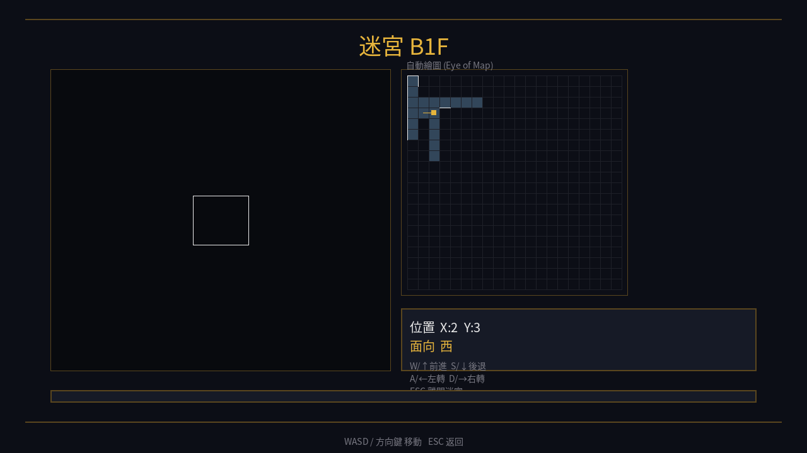
*v0.3 新增功能：已走過的格用藍色填、走過的牆顯示白線、黃色方塊是目前位置 + 朝向。*

### 致命陷阱地圖

| 陷阱 | 效果 |
|------|------|
| **Pit** | HP 直接 -1d8 |
| **Chute** | 強制掉到下一層的隨機位置 |
| **Spinner** | 旋轉你的朝向，讓你迷失方向 |
| **Teleporter** | 傳送到迷宮另一處（黑暗中你完全不知道在哪） |
| **Rock** | 卡住整個小隊一回合 |
| **Fizzle Square** | 暫時禁止施法 |
| **Stuck Door** | 必須劈開才能過 |

> 老玩家的 1980 年代生存技巧：**右手永遠扶著牆**走，一定能繞回起點。
> 直到你踩到第一個 Spinner，這個技巧就破功——它就是設計來破解扶牆法的。

---

<a name="screenshots"></a>
## 📸 實機截圖展示 (v1.9–v1.23)

> 重新跑 `tools/regen_snapshots.sh` 可隨時重生這些圖。

### 群組 A：新手導覽（v1.9 intro overlay）

第一次啟動時自動播放 5 張投影片，介紹故事與基本操作：

| 第 1 頁：歡迎 | 第 5 頁：戰鬥 |
|---|---|
| 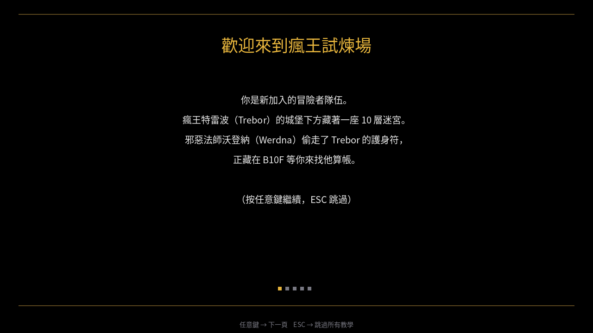 | 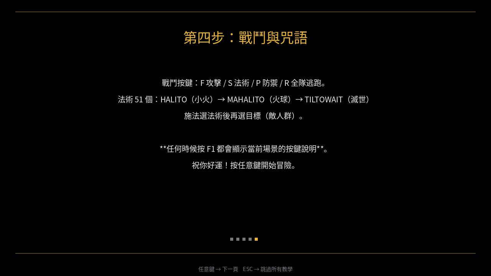 |
| *瘋王特雷波、邪惡法師沃登納、B10F 護身符* | *F 攻擊 / S 法術 / P 防禦 / R 全隊逃跑* |

完整 5 頁拼貼：[`docs/v19_intro_montage.png`](docs/v19_intro_montage.png)

### 群組 B-2：F3 切換視覺主題（v1.12）

任何場景按 **F3** 即輪替主題；對應的怪物美術會即時換成衍生風格。
**PCE-CD（彩色原版）** 為預設，**Mono / Outline / Sepia** 為從 PCE-CD
master 自動產生的衍生作品（共用 CC-BY-SA 4.0 授權）。

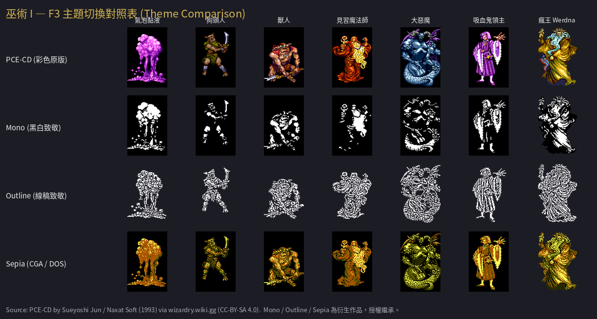

> 額外的 **PC-98 / WonderSwan / Macintosh / PCE-CD 本地音樂** 主題為
> 「本機 only」— 使用者用 `tools/extract_*.sh` 從自己合法持有的 ROM
> 抽取，存到 `assets/themes/{pc98,wsc,mac,pcecd_local}/`，不會 commit 到 repo。

### 群組 B：F1 隨時叫出按鍵說明（v1.7 help overlay）

任何場景按 **F1** 即顯示當前操作說明，再按一次或任意鍵關閉：

| 迷宮 | 戰鬥 | 城堡 |
|---|---|---|
| 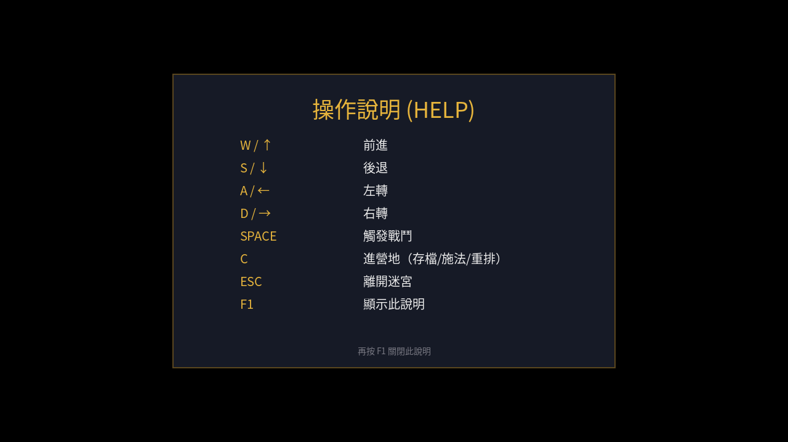 | 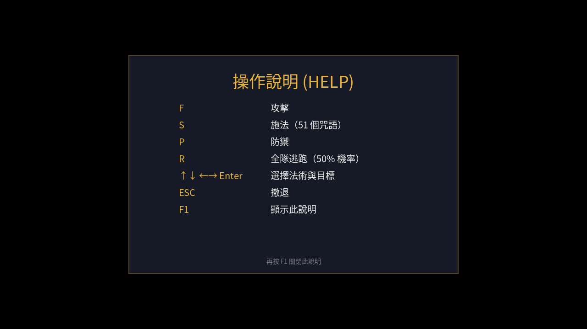 | 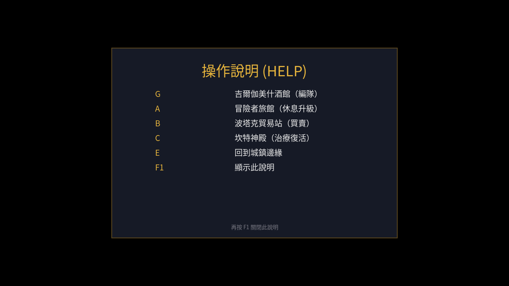 |
| *WASD 移動、SPACE 戰鬥、C 營地* | *F/S/P/R + 法術 / 目標選擇* | *G 酒館 / A 旅館 / B 商店 / C 神殿* |

### 群組 C：城鎮邊緣 — 全中文 demo party（v1.8）

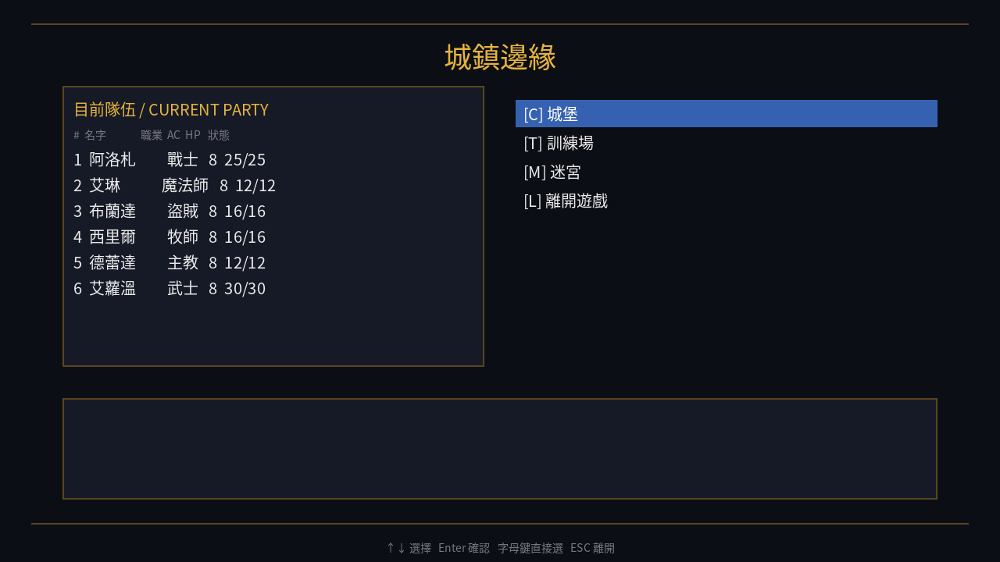

*6 個 demo 角色全中文：阿洛札 / 艾琳 / 布蘭達 / 西里爾 / 德蕾達 / 艾蘿溫，職業也全中文（戰士 / 魔法師 / 盜賊 / 牧師 / 主教 / 武士）。*

### 群組 D：戰鬥場景 — PCE-CD 怪物立繪（v1.4）

| 沃登納 Werdna (B10F 終戰) | 吸血鬼領主 Vampire Lord | 鬼火 Will-o-Wisp |
|---|---|---|
| 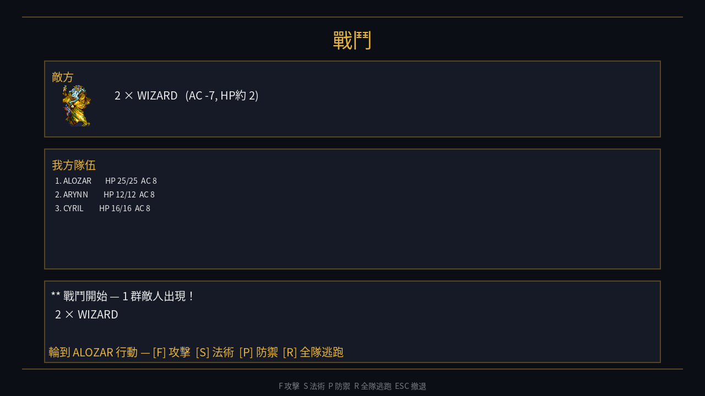 | 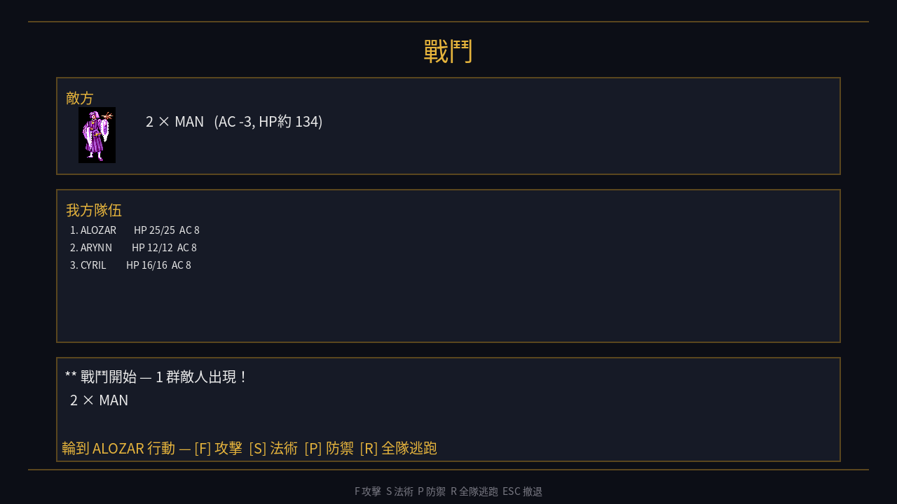 | 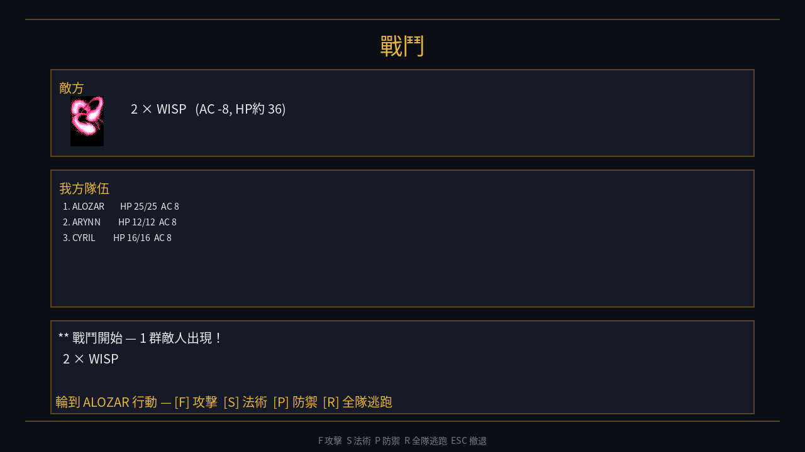 |
| *AC -7、TILTOWAIT 連發* | *AC -3、能吸等級* | *AC -8 物理難命中，咒語秒殺* |

### 群組 E：61 張 PCE-CD 怪物立繪總覽

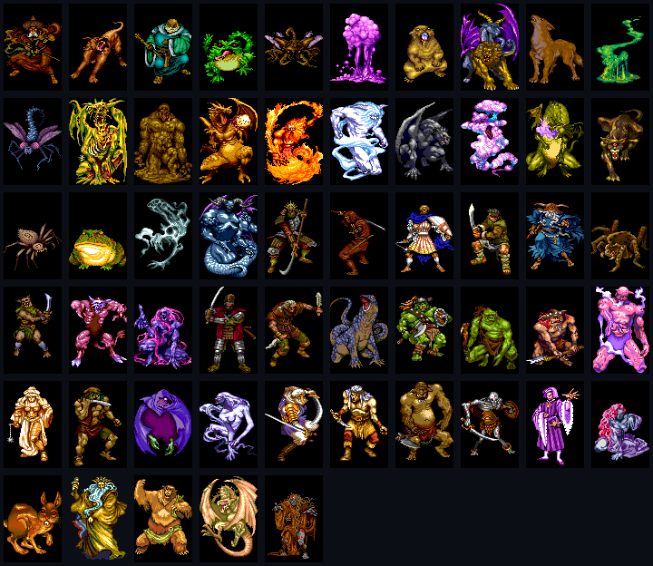
*61 張 PCE-CD（PC Engine CD-ROM²，1988 NEC HuCard 主機的 1991 CD 增訂版）怪物立繪
（從 [wizardry.wiki.gg](https://wizardry.wiki.gg) 取得，CC-BY-SA 4.0 — Creative Commons 創用 CC「姓名標示-相同方式分享 4.0 國際」授權）。
30 個怪物資料 entry 100% 對應到 sprite。執行 `tools/fetch_pcecd_sprites.sh` 取得；現已 bundle 進 repo。*

### 群組 F：迷宮 + 自動繪圖 (Eye-of-Map)

| 迷宮 3D 線框透視 + mini-map |
|---|
|  |
| *已走過的格子自動 reveal，黃色方塊是當前位置 + 朝向* |

### 群組 G：v0.3 Camp 營地存檔

| 營地選單 | 角色檢視 |
|---|---|
| 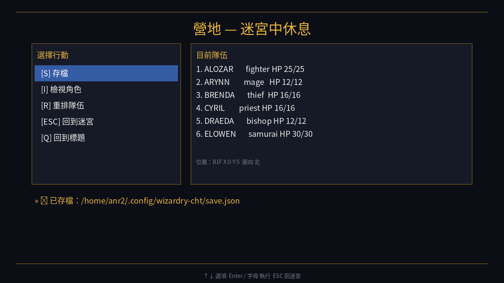 | 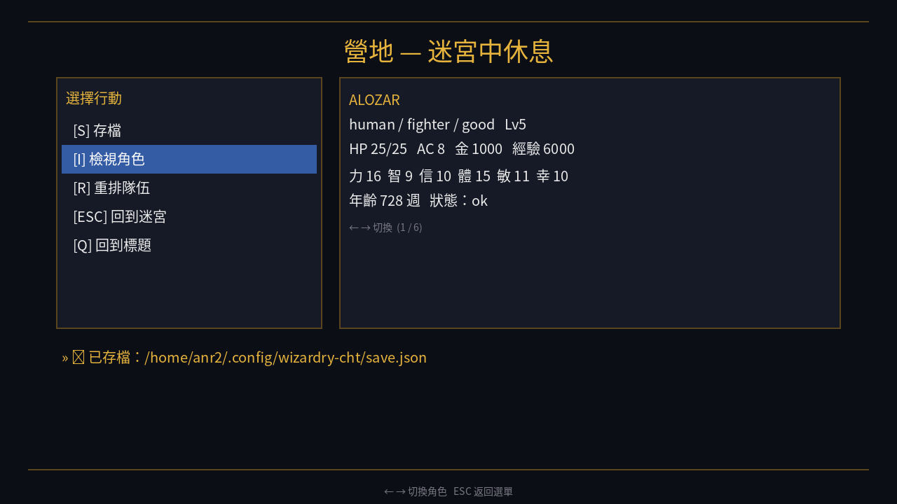 |
| *存檔到 `~/.config/wizardry-cht/save.json`* | *屬性 / HP / 經驗 / 年齡 / 狀態* |

### 群組 H：1991 OVA 動畫致敬（v1.8）

| 城堡空照 | Kandi 訴說 |
|---|---|
| 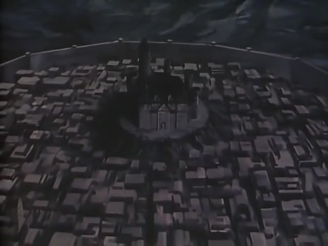 | 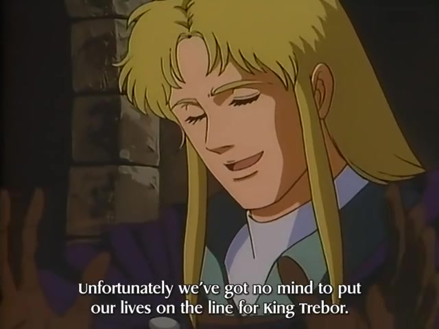 |
| *Trebor 王座下方 10 層試煉場* | *TMS Entertainment 1991 動畫，篠原俊哉導演* |

---

<a name="taiwan-1985"></a>
## 🏛️ 台灣 Apple II 老玩家的記憶

1980 年代中期，台灣的電腦市場剛剛從 Apple II 仿製機進入 PC/XT 時代。
那個年代的少年玩家——若你今天 50 多歲、若你在補習班同學中傳閱過 5.25 吋磁片——
你可能玩過 Wizardry，但你可能從來沒見過它的中文版。

那個年代台灣最常見的 Wizardry 玩法是：
1. 在電腦展買盜版磁片，封面用噴墨印機印「巫術」兩個字
2. 抄一張 20×20 的方格紙當地圖
3. 拿 ATTRIB 鎖磁片防止覆寫存檔
4. 用 *Computer Gaming World* 或 *Compute!* 雜誌的英文攻略對照

當時的玩家社群沒有 Wiki、沒有翻譯、沒有 YouTube。
*Bushwhacker* 從來沒人翻過名字；*Murphy's Ghost* 大家都記得它是「擋路那個鬼」；
*Werdna's Amulet* 沒人懂為什麼那條短項鍊那麼難拿。

**這個專案就是要把那段空白補起來。**

如果你的記憶裡有「巫術」這個詞、有 5.25 吋磁片旋轉的聲音、
有用方格紙畫迷宮被同學偷看的回憶——
這個專案是寫給你的。

---

<a name="ova"></a>
## 🎬 1991 OVA — TMS Entertainment 動畫致敬

1991 年 2 月，**TMS Entertainment**（製作《魯邦三世》《名偵探柯南》的同一家公司）
推出了 **50 分鐘的 Wizardry I OVA**，導演篠原俊哉。這是 Wizardry 系列**唯一一部官方動畫**——
講六人小隊深入瘋王迷宮、與 Werdna 對決的完整故事，**含官方角色設定與配音**。

4 張代表幀（檔案在 [`docs/ova_frames/`](docs/ova_frames/)）：

| 開場：城堡與迷宮入口 | Kandi 公主的訴說 |
|---|---|
|  |  |
| *Trebor 王座下方挖出 10 層試煉場* | *「Unfortunately we were not destined to live our lives in the life-locking forces…」* |

| 主角的覺悟 | 小隊紮營 |
|---|---|
| 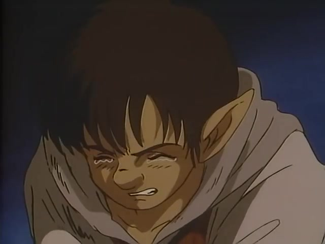 | 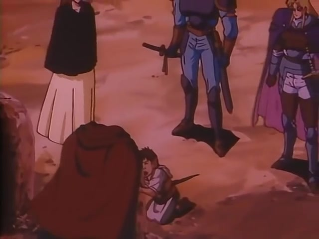 |
| *Kandi 公主：「To test his true power…」* | *冒險者準備下迷宮前的營火夜談* |

> 全片 50:43 / 480p MP4 在 [archive.org/wizardry-1-ova](https://archive.org/details/wizardry-1-ova)（330MB），
> 由 Ureshii fan-sub group 製作英文字幕。本專案僅截 4 張代表幀作非商業致敬使用。

---

<a name="v32-fixes"></a>
## 🔧 snafaru v3.2 — 45 年後的 100 項修正

[snafaru](https://github.com/snafaru) 在 2023–2026 年間，
基於 Thomas William Ewers 反組譯出的 Wizardry I UCSD Pascal 源碼，
做出了 v3.2 版——**修正了 100+ 個歷史 bug 並做了大量遊戲性平衡調整**。

本專案的 C++ 重寫**完整繼承**這些修正。挑幾項重要的列：

| 修正類別 | 例 |
|---------|------|
| 法術修正 | **Latumapic 真名術現在生效**（原版根本沒功能）<br>**Manifo 麻痺術現在生效**（原版只有動畫沒效果）<br>Mahaman / Haman 各有 7 種正確隨機效果<br>Loktofeit 成功率改為 65 + 角色等級 % |
| 戰鬥修正 | 顯示命中機率<br>顯示怪物施法<br>**怪物 surprise round 不能施法**（避免一回合滅團）<br>怪物 drain 一場戰鬥最多生效一次（不然 vampire 群會吸光全隊等級） |
| 職業修正 | **Ninja 從 17/17 降為 15/15**（讓這個職業實際可玩）<br>Ninja 赤手傷害從 2d4 提升到 2d8<br>Ninja 每 1 級 -1 AC（原為每 3 級） |
| 道具修正 | 寶箱陷阱實際生效<br>道具特殊編號 23 不再無效<br>偵測陷阱失敗時不再亂跳到別格 |
| UI 修正 | Camp 畫面即時更新 HP 與狀態<br>毒角色 HP 即時扣減顯示<br>中毒角色 quickplot 顯示修復 |
| 探索修正 | Maze 的彩蛋與特殊遭遇重新啟用<br>FIZZLE 格逃出後法術回復正常<br>不再有「在迷宮被卡住強制 reboot」的災難 |

完整 100+ 修正清單見 [snafaru/Wizardry.Code/list-of-fixes-Wizardry.Code](https://github.com/snafaru/Wizardry.Code/tree/main/list-of-fixes-Wizardry.Code)。

---

<a name="technical-deep-dive"></a>
## 🔬 Technical Deep Dive

### 為什麼是重寫，而不是 patch？

snafaru 的源碼是 **UCSD Pascal**——一種 1970 年代由加州大學聖地牙哥分校（University of California, San Diego, UCSD）
設計的 P-Code（Pseudo-code，類似今天 Java bytecode 的中介碼）Pascal 方言。
它的 runtime（執行期）跑在 Apple II 的 64KB 記憶體裡，文字介面只支援 7-bit ASCII（美國資訊交換標準碼，無法表示中日韓字）。

要顯示中文，原則上有兩條路：

| 方案 | 優點 | 缺點 |
|------|------|------|
| **A. 留在 Apple II / UCSD Pascal**<br>在 HGR mode 寫中文 bitmap 字型驅動，攔截 WRITE → 改成繪圖呼叫 | 保留 1981 年原汁原味 | 需重寫所有 IO，40-column 排版全部要重做，極困難 |
| **B. 重寫到現代平台**（本專案採用）<br>UCSD Pascal → C++17，SDL2 + TTF（TrueType Font 向量字型） | 字型 / 排版 / 跨平台全部解決<br>能繼承所有 v3.2 修正<br>未來可加入存檔 / Eye-of-Map / 戰鬥動畫 | 等於從頭實作整個遊戲 |

選擇 B 之後，我們得到的好處是：**1280×720 自由排版 + TTF 抗鋸齒中文**——
這比 Apple II 的 40-column 字元美觀好幾個世代。

### 架構：Layered 4 層

```
┌─────────────────────────────────────┐
│  game/        — Scene state machine │   Title / Edge / Castle / Maze / Combat
├─────────────────────────────────────┤
│  render/      — SDL2 渲染層         │   Window / Font / UI / Maze 3D / Auto-Map
├─────────────────────────────────────┤
│  core/        — Pascal 1:1 移植     │   Character / Monster / Item / Maze / Combat
├─────────────────────────────────────┤
│  i18n/  save/ data/ — 資料層        │   JSON catalogue / Roster / Items DB
└─────────────────────────────────────┘
```

關鍵原則：**core/ 不依賴 SDL**——這讓單元測試能在 CI 上 headless 跑。

### Pascal RECORD → C++ struct 對映

Pascal 原始的 TCHAR（角色記錄型別，`WIZ.TEXT:62-105`）用 PACKED（緊湊位元打包）跟 CASE 變體（variant record，類似 C 的 union），約 282 bytes：

```pascal
TCHAR = PACKED RECORD
  NAME, PASSWORD: STRING[15];
  INMAZE: BOOLEAN;
  RACE, CLASS, AGE, STATUS, ALIGN: 0..15;
  ATTRIB: ARRAY[1..6] OF 0..18;
  GOLD, EXP: PACKED ARRAY[1..3] OF 0..255;  (* 3-byte long arith *)
  POSS: ARRAY[1..8] OF TOBJSLOT;
  ...
  LOSTXYL: CASE INTEGER OF
    0: (LOCATION: ARRAY[1..4] OF INTEGER);
    1: (POISNAMT: ARRAY[1..4] OF 0..255);
    2: (AWARDS: ARRAY[1..4] OF 0..255);
END;
```

C++ 等價（`src/core/character.h`）：

```cpp
struct Character {
    std::string name;
    std::string password;
    bool in_maze = false;
    Race race;            // enum class
    Klass klass;          // enum class
    Alignment alignment;  // enum class
    Status status;        // enum class
    std::uint16_t age = 14 * 52;
    Attributes attr;
    long_t gold = 0;          // int64_t 取代 3-byte packed
    long_t experience = 0;
    std::uint8_t char_level = 1;
    std::int16_t hp_left = 0;
    std::int16_t hp_max = 0;
    std::uint8_t armor_class = 10;
    std::array<bool, 51> spells_known;
    std::array<std::uint8_t, 7> mage_spell_slots;
    std::array<std::uint8_t, 7> priest_spell_slots;
    std::array<ItemSlot, 8> inventory;
};
```

**設計選擇**：不沿用 PACKED bit field（位元欄位緊湊配置）的 layout（記憶體布局）——因為 1981 年的記憶體限制現在沒了，
**直接用 int64_t 取代 3-byte「long」arithmetic**（原 Pascal 為了省空間，用三個 byte 模擬大整數運算）。
這讓原版的 ADDLONGS / MULTLONG / DIVLONG（加 / 乘 / 除三組長整數副程式）變成 trivial（C++ 原生運算子直接搞定）。

### Eye-of-Map 演算法

v0.3 的自動繪圖：

```cpp
void reveal_from(MazeLevel& m, const Camera& cam) {
    m.visited[cam.y][cam.x] = true;
    // 沿著朝向，最多 4 格，每遇到牆就停
    for (int step = 0; step < 4; ++step) {
        Wall front = wall_in_facing(m, x, y, cam.facing);
        if (front == Wall) break;
        x += dx; y += dy;
        m.visited[y][x] = true;
        if (front == Door || front == HiddenDoor) break;
    }
}
```

每次移動或轉向後自動 reveal。已探訪格在 mini-map 上塗藍，已知牆塗白線。

### 字串抽取與 i18n

`tools/extract_strings.py` 掃所有 `*.TEXT.txt`，用 regex `'((?:[^']|'')*)'` 抓字串字面值。
結果：

```json
{
  "summary": {
    "files_scanned": 38,
    "total_string_occurrences": 444,
    "unique_strings": 334,
    "total_source_chars": 6234
  }
}
```

每條字串得到一個 slug key（如 `'WHO WILL JOIN ? >'` → `who_will_join`）。
這些 keys 就是 `tr()` 查表的索引：

```cpp
ui.draw_line(tr("castle"), x, y, color);
// 找不到 zh_TW 翻譯時自動 fallback 到 en
```

### 法術解析（戰鬥）

```cpp
if (name == "TILTOWAIT") {
    for (auto& g : groups) {
        int dmg = rng.dice(10, 15);   // 10d15
        g.hp_total -= dmg;
    }
}
```

51 條法術定義在 `assets/data/spells.json`，戰鬥引擎根據 spell name 分支。
目前 v0.3 實作了 6 個核心咒語（HALITO / MAHALITO / KATINO / DIOS / BADIOS / TILTOWAIT）—剩下的會在 v0.4 補齊。

### 為什麼選 Noto Sans CJK TC？

- **OFL 授權**（SIL Open Font License 1.1，開源字型授權）：可以打包進 release，不會有 distribution（散布）問題
- **完整 CJK 字符**（中日韓統一表意文字）：14,000+ 個漢字，包括罕用怪物名
- **20 種 weight**（字重 / 粗細）：從 Thin（極細）到 Black（極粗），未來可以分標題 / 內文 / 強調
- **跨平台**：Linux 預裝、Windows 可自帶、字型 hint（微調渲染指令）一致

對比：Microsoft 正黑體 / 蘋方都**不可打包**（商業字型，授權限制），PMingLiU（新細明體）老舊且權利不明。

---

<a name="knowledge-base"></a>
## 📚 中文百科

除了程式碼本身，本專案還整理了一套**繁體中文 Wizardry I 知識庫**——
把 45 年來分散在英文 wiki、攻略網站、訪談、Sir-tech 手冊裡的資料，
**全部用繁中重新編寫**。每篇都是 1500–3000 字的百科文章，包含：

| 文件 | 內容 | 適合誰看 |
|------|------|----------|
| [`docs/LORE.md`](docs/LORE.md) | 故事與起源 — Trebor 與 Werdna 的關係、護身符傳說、Sir-tech 公司歷史、Greenberg/Woodhead 訪談、為何叫 Mad Overlord | 想了解**為什麼有這個遊戲**的人 |
| [`docs/WALKTHROUGH.md`](docs/WALKTHROUGH.md) | 10 層迷宮中文攻略 — B1F〜B10F 路線、Murphy's Ghost 經驗農場、Blue Ribbon、Contra Dextra Avenue、Werdna 戰術 | **卡關**或想**少走冤枉路**的人 |
| [`docs/MONSTERS.md`](docs/MONSTERS.md) | 30+ 怪物百科 — 中文名 + HP/AC/XP、特殊能力（吸等級、麻痺、群攻）、應對戰術、PCE-CD 立繪歷史 | 想知道**誰可以打、誰要逃跑**的人 |
| [`docs/SPELLS.md`](docs/SPELLS.md) | 51 法術完整解說 — HA-/MA-/LA-/DA-/DI-/BA- 前綴語法、傷害公式、戰術組合、v3.2 修正 | 想搞懂**為什麼 TILTOWAIT 叫等等！**的人 |
| [`docs/ITEMS.md`](docs/ITEMS.md) | 道具圖鑑 — 武器/防具/藥水/卷軸/戒指/護符，含 Werdna's Amulet 詛咒機制、Boltac 鑑定價格 | 想避免**穿到詛咒裝備脫不下來**的人 |
| [`docs/MAPS.md`](docs/MAPS.md) | B1F〜B10F 全 10 層原版地圖轉錄 — 中文標籤 SVG，門 / 暗門 / 陷阱 / 樓梯位置標示 | 想**對照地圖走迷宮**的人 |
| [`docs/MANUAL_GAP.md`](docs/MANUAL_GAP.md) | Sir-tech 原版手冊 vs Digital Eclipse 2024 重製版的規則差異對照 — v3.2 修正落點 | 想了解**本專案規則決策依據**的人 |
| [`docs/DEV_HISTORY.md`](docs/DEV_HISTORY.md) | 中文化開發史 — v0.3→v1.18 各版本設計決策、踩過的坑（vcpkg pkgconf 404 / xdotool focus / Apple II HGR 詭異設計）、未來方向 | 想做**類似 retro 重寫專案**的開發者 |

> **總計約 25,000 中文字**——是 Wizardry I 史上**最完整的繁體中文百科**。
> 全部 CC-BY 4.0 授權，歡迎引用、轉載、改寫。

---

<a name="credits"></a>
## 📜 License & Credits

### 原作

- **Wizardry: Proving Grounds of the Mad Overlord** (1981)
  - Designed by **Andrew Greenberg** & **Robert Woodhead**（安德魯・格林伯格 與 羅伯特・伍德海德）
  - Published by **Sir-tech Software**（賽爾科技軟體）
  - IP（智慧財產權）目前歸 **Drecom**（株式会社ドリコム，日本東京遊戲公司）旗下

### 重寫與修正基底

- **[snafaru/Wizardry.Code](https://github.com/snafaru/Wizardry.Code)** — UCSD Pascal 源碼 + v3.2 100+ 修正
- **Thomas William Ewers** — Wizardry I Pascal/Assembly 原始反組譯
- **4am** — v3.2 字型修正
- **Qkumba** — RNG 與記憶體安全修正

### 字型

- **Noto Sans CJK TC**（思源黑體繁中，Google 與 Adobe 聯合開發，SIL Open Font License 1.1 開源字型授權）

### 法律聲明

本專案**僅供學習與研究用途**，不販售。Wizardry 為 Sir-tech / Drecom 註冊商標。
本專案的 C++ 重寫程式碼以 **MIT License**（麻省理工學院寬鬆授權，見 [`LICENSE`](LICENSE) 英文原文 / [`LICENSE.zh.md`](LICENSE.zh.md) 中文意譯）發佈；
原 Pascal 源碼版權歸 snafaru 上游所有；
遊戲規則與設計概念屬於 Wizardry 原作者群。

> *「Where the maze gives Werdna pause, even the brave should be cautious.」*
> — Wizardry I 開場字幕，新譯：「連 Werdna 也會躊躇之處，勇者亦當審慎前行。」

---

**Made with 🧙 in Taiwan, 2026.**
