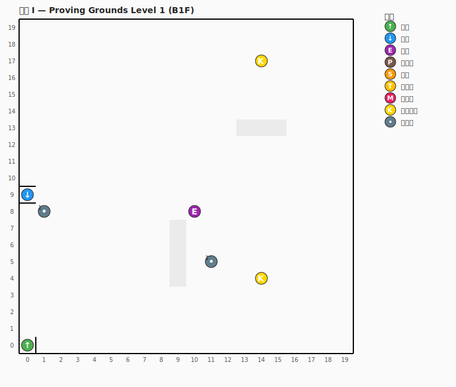
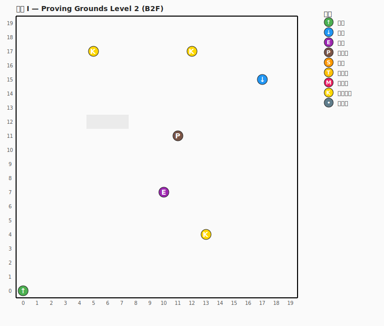
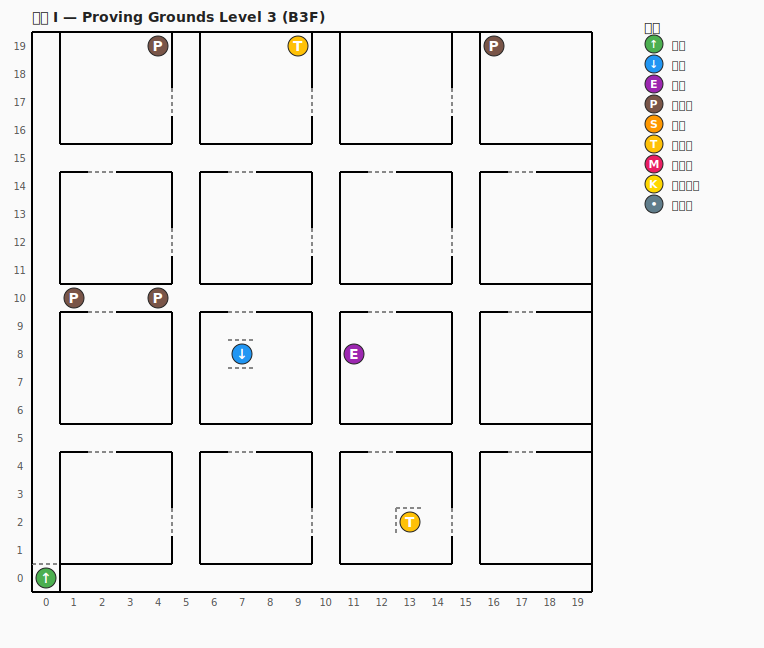
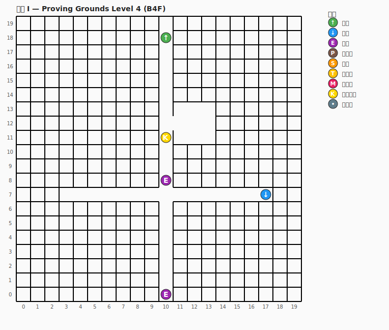
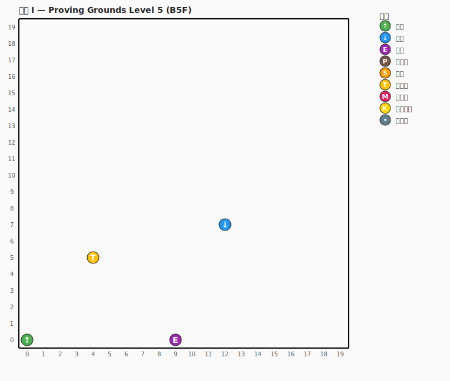
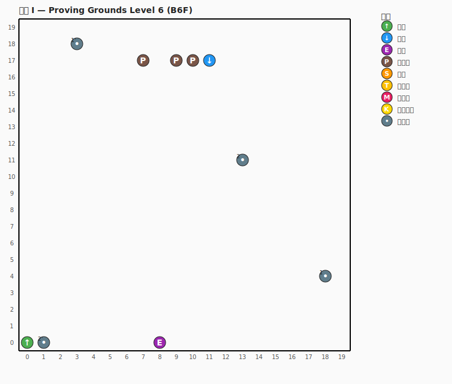
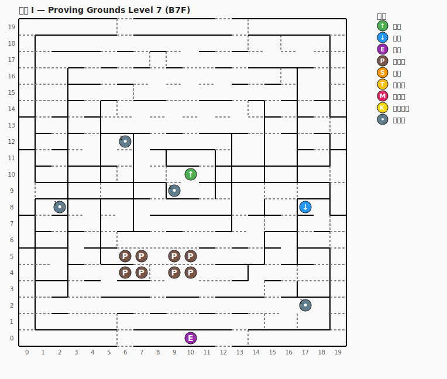
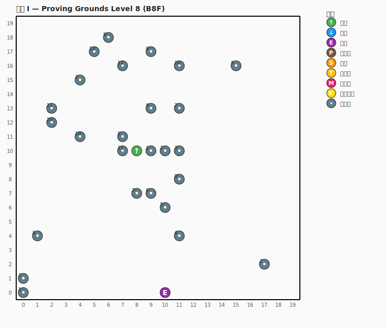
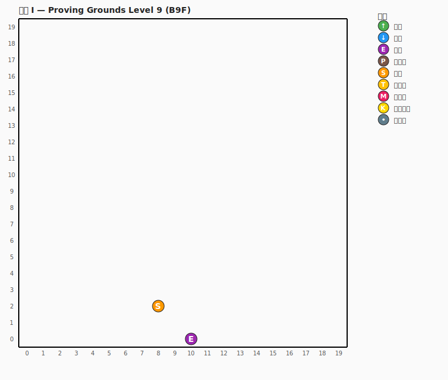
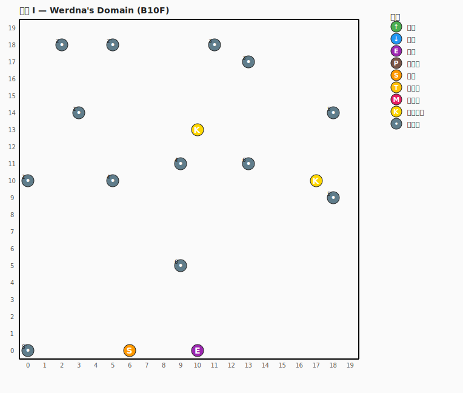

# 迷宮地圖 — 瘋王的試煉場 10 層全圖

> 本頁地圖依據 1981 年 Sir-Tech 原版設計繪製，資料來源包含
> 玩家社群整理的 `WizardryIMaps.pdf`（Rob Craig, 2010）與
> [tk421.net](https://www.tk421.net/wizardry/wiz1maps.shtml) 攻略網站，
> 已 commit 為 `assets/data/wiz1_mazes.json`，遊戲執行時由
> `src/data/maze_db.cpp` 載入。

---

## 圖例（共通）

| 符號 | 中文 | 英文 | 機制 |
| --- | --- | --- | --- |
| ↑ | 上樓 | Stairs Up | 回到上一層 |
| ↓ | 下樓 | Stairs Down | 走到下一層（按 Enter） |
| E | 電梯 | Elevator | 連接多層的快速通道 |
| P | 陷阱坑 | Pit | 跌落，全隊各受 1d8 傷害 |
| S | 滑梯 | Chute / Shoot | 強制掉到下一層的隨機格 |
| T | 旋轉盤 | Turn Table / Spinner | 進入瞬間改變朝向 |
| M | 傳送門 | Teleporter / Warp | 瞬間移動到另一座標 |
| K | 關鍵道具 | Key Item | 通關所需物品 |
| • | 標記點 | Marker | 攻略中編號的位置 |

虛線 = 門（可穿過），實線 = 牆，灰底 = 黑暗區（`MILWA` 才看得見）。

---

## B1F — 試煉場第一層（Proving Grounds Level 1）



**重點**
- 起點 `(0, 0)` 樓梯上 — 剛從城堡進來會出現在這裡
- `(0, 9)` 樓梯下 — 通往 B2F
- `(10, 8)` 電梯 — 直達 B4F
- `(13, 5)` 「Murphy's Ghost」遭遇點 — 知名練等地點
- 中央 `x=9~10` 帶狀黑暗區，過了才能進到右半邊

---

## B2F — 試煉場第二層



**重點**
- `(0, 0)` 樓梯上回 B1F、`(17, 15)` 樓梯下到 B3F
- 3 個關鍵道具 — 收集後可在城堡商店識別
- 1 個陷阱坑與電梯共構，新手注意

---

## B3F — 試煉場第三層



**重點**
- 4 個陷阱坑密集出現 — 建議用 `DUMAPIC` 確認座標
- 2 個旋轉盤 — 進入後立即測試朝向，免得迷路
- 電梯仍存在，是回城最快路徑

---

## B4F — 試煉場第四層



**重點**
- `(10, 0)` 快速電梯 — 直達 **B9F**，是後期跳級的關鍵
- 關鍵道具一枚

---

## B5F — 試煉場第五層



**重點**
- 結構較單純，主要為過渡層
- 1 個旋轉盤
- 兩座樓梯與電梯齊備

---

## B6F — 試煉場第六層



**重點**
- 3 個陷阱坑、4 個攻略標記點
- 攻略推薦先繞外圈再進中央

---

## B7F — 試煉場第七層



**重點**
- 陷阱坑 **8 個**，本層最危險
- 攻略推薦帶 `CALFO` 鑑定陷阱

---

## B8F — 試煉場第八層



**重點**
- 「Maze of Confusion」傳送迷宮，27 個編號標記
- 不靠攻略幾乎走不出去 — 建議手繪走過的格子

---

## B9F — 試煉場第九層



**重點**
- 結構非常簡短，主要功能是進入 Werdna 領域的緩衝層
- `(8, 2)` 滑梯 — **唯一通往 B10F 的路徑**

---

## B10F — Werdna 領域（Werdna's Domain）



**重點**
- 終章樓層 — 瘋王 **Werdna** 的據點
- 13 個編號標記 — 多重傳送陷阱保護核心
- 2 個關鍵道具 — 其中之一為通關物「**Werdna 護身符**」

---

## 重生產生方式

每張 SVG 由 `tools/render_maze_svgs.py` 從
[`assets/data/wiz1_mazes.json`](../assets/data/wiz1_mazes.json) 自動產生：

```bash
python3 tools/render_maze_svgs.py
```

JSON 改動 → 重跑 script → SVG 自動更新。

---

*資料來源：1981 年 Sir-Tech《Wizardry: Proving Grounds of the Mad Overlord》
原版地圖座標。轉錄參考 Rob Craig 的 WizardryIMaps.pdf 與 tk421.net 攻略網站。
全部座標僅為遊戲事實狀態，非可版權之創作元素。*
