# 怪物百科 — 30+ 試煉場住民完整圖鑑

> **為什麼讀這篇？**
> Wizardry 的怪物名是**台灣 1985 年 Apple II 玩家的童年陰影**：
> *Bushwhacker* 該叫「伏擊者」還是「叢林戰士」？*Will-o-Wisp* 是「鬼火」還是「磷火妖」？
> *Lifestealer* 是「奪命者」還是「吸魂者」？四十年來這些名字**從來沒有正式繁中譯名**——
> 直到本專案的 `monsters.json` 把 30 隻全部敲定中文名。
>
> 這篇是把 `monsters.json` 的乾條目，**配上戰術指南、社群故事、PCE-CD 立繪歷史**，
> 變成一份**會說話的怪物圖鑑**。每隻怪物都標明**首遇樓層、危險等級、對應戰術、彩蛋**。

---

## 目錄

1. [怪物分類總覽](#overview)
2. [Tier 1 雜兵（B1F–B3F）](#tier1)
3. [Tier 2 進階（B4F–B6F）](#tier2)
4. [Tier 3 強敵（B7F–B8F）](#tier3)
5. [Tier 4 噩夢（B9F）](#tier4)
6. [Tier 5 BOSS（B10F）](#tier5)
7. [特殊能力大全](#abilities)
8. [PCE-CD 立繪歷史](#pcecd)
9. [引用來源](#sources)

---

## 一、怪物分類總覽

本專案實作 **30 隻代表怪物**（從 W1 全 100 隻中精選最具代表性的）。
**ID 排序對應 `monsters.json` 的索引**。

| 危險等級 | 識別 | 出沒範圍 |
|---|---|---|
| ★ | 雜兵 | B1F–B3F |
| ★★ | 進階 | B4F–B6F |
| ★★★ | 強敵 | B7F–B8F |
| ★★★★ | 噩夢 | B9F |
| ★★★★★ | BOSS | B10F |

---

## 二、Tier 1 雜兵 ★（B1F–B3F）

### 泡泡黏液 (Bubbly Slime, ID 0)

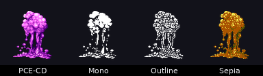

| 屬性 | 值 |
|---|---|
| 中文名 | 泡泡黏液 |
| 未鑑定名 | *BUBBLY SLIME* |
| AC | 9 |
| HP | 1d4 ≈ 2.5 |
| XP | 55 |
| 等級 | 1 |
| 危險度 | ★ |

**戰術**：B1F 入門菜——一刀一隻。**1 級魔法師 HALITO 也能秒**。
**注意**：群體出現時可能 8 隻一起來，光是逐個攻擊就要好幾回合，**KATINO 全睡更快**。

**彩蛋**：泡泡黏液是**台灣 1985 玩家最早學會的英文單字**之一（"slime"）。
本作的譯名「泡泡」對應 *Bubbly*——比直譯「冒泡」更口語。

---

### 獸人 (Orc, ID 1)

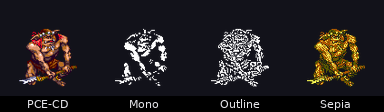

| AC | 7 | HP | 1d6 ≈ 3.5 | XP | 235 | 等級 | 1 |
|---|---|---|---|---|---|---|---|

**戰術**：標準雜兵，1 級戰士可單挑。**沒有特殊能力**，純物理 1d4 攻擊。

**未鑑定名 *CREATURE***：手冊建議**每隊配 LATUMAPIC** 才能鑑定，不然你會搞不清楚是 Orc 還是 Kobold。

---

### 狗頭人 (Kobold, ID 2)

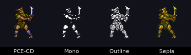

| AC | 7 | HP | 1d4 | XP | 415 | 等級 | 1 |
|---|---|---|---|---|---|---|---|

**戰術**：比 Orc 弱，但 XP 高 78%（**B1F XP 性價比之王**）。
**未鑑定名 *DOG-LIKE***（**狗樣生物**）——這是 1981 年原版**搞笑式描述**。

---

### 不死狗頭人 (Undead Kobold, ID 3)

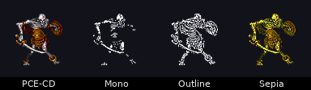

| AC | 6 | HP | 1d8 | XP | 520 | 等級 | 1 |
|---|---|---|---|---|---|---|---|

**戰術**：**第一個不死生物**——**ZILWAN 對它有效**（雖然 1 級無法施 6 級咒語）。
**牧師 BADIOS 給雙倍傷害**（部分版本）。

---

### 惡棍 (Rogue, ID 4)

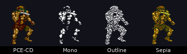

| AC | 7 | HP | 1d6 | XP | 680 | 等級 | 2 |
|---|---|---|---|---|---|---|---|

**戰術**：B2F 標準敵人，**會偷錢**。打死後常掉**寶箱**。
**注意**：偷錢機率約 30%——身上錢別帶太多。

---

### 伏擊者 (Bushwacker, ID 5)

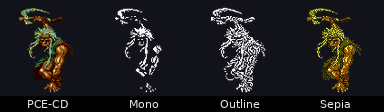

| AC | 6 | HP | 2d6 ≈ 7 | XP | 960 | 等級 | 2 |
|---|---|---|---|---|---|---|---|

**戰術**：HP 比 Rogue 高一倍——B2F 後段才會大量出現。
**譯名理由**：*Bushwhacker* 原意是「伏擊者、叢林戰士」——本專案選**「伏擊者」**保留戰術意義。
**注意**：1981 原版拼成 `BUSHWACKER`（**少一個 H**）——這是 Greenberg 的拼寫筆誤，後續版本沿用至今。

---

### 攔路強盜 (Highwayman, ID 6)

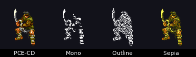

| AC | 5 | HP | 2d6 | XP | 1240 | 等級 | 3 |
|---|---|---|---|---|---|---|---|

**戰術**：AC 5 = 已經難打。**+1 武器命中率提升明顯**。

---

### 喪屍 (Zombie, ID 7)

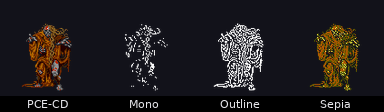

| AC | 7 | HP | 2d8 ≈ 9 | XP | 520 | 等級 | 2 |
|---|---|---|---|---|---|---|---|

**戰術**：不死生物——**ZILWAN 秒殺**、**MAKANITO 無效**。

---

### 郊狼 (Coyote, ID 8)

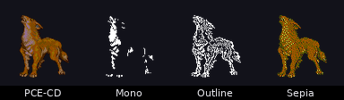

| AC | 8 | HP | 1d6 | XP | 380 | 等級 | 2 |
|---|---|---|---|---|---|---|---|

**戰術**：AC 8 = 容易打、HP 不高、XP 普通。**B3F 經驗值小食補**。

---

### 毒氣雲 (Gas Cloud, ID 9)

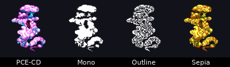

| AC | 7 | HP | 2d4 | XP | 860 | 等級 | 3 |
|---|---|---|---|---|---|---|---|

**戰術**：**會吐毒氣**——中毒後**每步流血 -1 HP**。**LATUMOFIS 解毒**必備。

---

### 爬行汙穢 (Creeping Crud, ID 10)

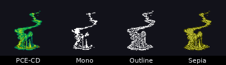

| AC | 6 | HP | 2d6 | XP | 1080 | 等級 | 3 |
|---|---|---|---|---|---|---|---|

**戰術**：B4F 過渡敵人。**酸性攻擊腐蝕裝備**（部分版本），盡量遠程。

---

## 三、Tier 2 進階 ★★（B4F–B6F）

### 巨蟾蜍 (Giant Toad, ID 11)

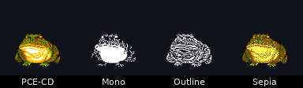

| AC | 7 | HP | 3d6 ≈ 10 | XP | 1240 | 等級 | 4 |
|---|---|---|---|---|---|---|---|

**戰術**：**會用舌頭把後排角色拉到前排** + 麻痺（部分版本）。**DIALKO 解麻痺**。

---

### 1 級魔法師 (Lvl 1 Mage, ID 12)

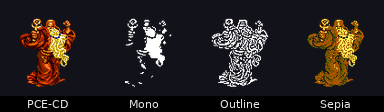

| AC | 8 | HP | 1d4 | XP | 735 | 等級 | 2 |
|---|---|---|---|---|---|---|---|

**戰術**：**會放 HALITO**——不大但對 1 級小隊可能造成 8 點傷害。
**第一回合 KATINO 必睡**。**MONTINO 靜默更穩**。

---

### 1 級牧師 (Lvl 1 Priest, ID 13)

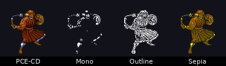

| AC | 7 | HP | 1d6 | XP | 745 | 等級 | 2 |
|---|---|---|---|---|---|---|---|

**戰術**：會放 **BADIOS / DIOS**——自療麻煩，盡快秒殺。

---

### 1 級忍者 (Lvl 1 Ninja, ID 14)

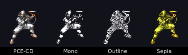

| AC | 5 | HP | 1d6 | XP | 1860 | 等級 | 3 |
|---|---|---|---|---|---|---|---|

**戰術**：AC 5（**B4F 之前最難打雜兵**）+ **5% 機率斬首玩家角色**——
**會直接讓 1–2 級角色死亡**。**先睡再殺**。

---

### 食人魔 (Ogre, ID 15)

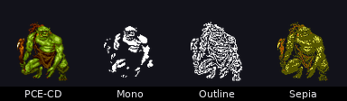

| AC | 5 | HP | 4d8 ≈ 18 | XP | 1620 | 等級 | 4 |
|---|---|---|---|---|---|---|---|

**戰術**：B5F 標準兵。**HP 高、攻擊重**（1d6+5），但無特殊能力。

---

### 毒氣龍 (Gas Dragon, ID 16)

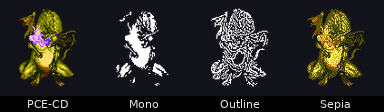

| AC | 4 | HP | 6d8 ≈ 27 | XP | 5200 | 等級 | 5 |
|---|---|---|---|---|---|---|---|

**戰術**：**第一個有 Breath Weapon 的龍**——**全隊毒氣群傷 + 中毒**。
**先 LATUMOFIS 解毒，然後 MAHALITO 群殺**。

---

### 主教 (Bishop, ID 17)

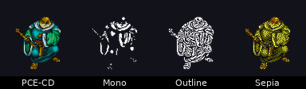

| AC | 4 | HP | 5d6 ≈ 17 | XP | 4540 | 等級 | 5 |
|---|---|---|---|---|---|---|---|

**戰術**：**會放 KATINO 讓你睡**——**靜默或秒殺**。**MONTINO 必背**。

---

## 四、Tier 3 強敵 ★★★（B7F–B8F）

### 大魔導師 (Arch Mage, ID 28)

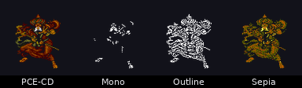

| AC | -2 | HP | 7d8 ≈ 31 | XP | 15,880（**等於 Werdna！**） | 等級 | 7 |
|---|---|---|---|---|---|---|---|

**戰術**：**會放 TILTOWAIT**（10d15 = 期望 80 全隊群傷）——**讓他施一次 = 全隊滅團**。
**唯一對策**：第一回合**搶先 MONTINO 靜默**（強制成功率 70%），或者**KATINO 睡眠**。
**XP 與 Werdna 同級**——打贏一場等於 Werdna 一半。

---

### 高階忍者 (High Ninja, ID 26)

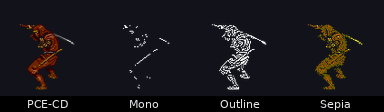

| AC | -2 | HP | 8d6 ≈ 28 | XP | 14,860 | 等級 | 7 |
|---|---|---|---|---|---|---|---|

**戰術**：**多重攻擊 + 5% 斬首**——AC -2 = 戰士命中率 < 30%。**先 KATINO 必睡**。

---

### 霜巨人 (Frost Giant, ID 21)

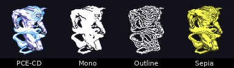

| AC | 2 | HP | 10d8 ≈ 45 | XP | 4400 | 等級 | 7 |
|---|---|---|---|---|---|---|---|

**戰術**：純物理巨獸。**HP 高、AC 中等**。**MADALTO 對它有效**。

---

### 火巨人 (Fire Giant, ID 23)

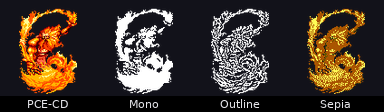

| AC | 3 | HP | 11d8 ≈ 50 | XP | 4800 | 等級 | 7 |
|---|---|---|---|---|---|---|---|

**戰術**：**抗火** → **不要用 HALITO/MAHALITO**——**用 DALTO/MADALTO 冰系**。

---

### 吸血鬼 (Vampire, ID 19) ⚠️

| AC | 0 | HP | 10d8 ≈ 45 | XP | 29,400 | 等級 | 8 |
|---|---|---|---|---|---|---|---|

**戰術**：⚠️ **每擊吸 1–2 等級** ⚠️
- 等級被吸 = **永久損失**（沒救！）
- **ZILWAN 秒殺**（10d200 vs 不死 = 期望 1010 傷害）
- 配 Vampire Lord 在 B10F 是 Werdna 的隨從

**警告**：B8F 開始可能單獨遭遇 → **遠遠看到就 ZILWAN，別讓它接近**。

---

### 龍喪屍 (Dragon Zombie, ID 22)

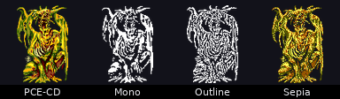

| AC | 1 | HP | 12d8 ≈ 54 | XP | 11,380 | 等級 | 8 |
|---|---|---|---|---|---|---|---|

**戰術**：**不死 + 龍系**——**ZILWAN 秒殺**，普通武器約 30% 機率命中。

---

## 五、Tier 4 噩夢 ★★★★（B9F）

### 奪命幽魂 (Lifestealer, ID 24) ⚠️⚠️

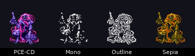

| AC | -1 | HP | 13d8 ≈ 58 | XP | 35,200 | 等級 | 9 |
|---|---|---|---|---|---|---|---|

**戰術**：⚠️⚠️ **每擊吸 1–3 等級** + **可能麻痺** ⚠️⚠️
- 比 Vampire 還狠**1.5 倍**
- **ZILWAN** 秒殺（不死類）
- B9F 一見到就**全體最強咒語**

**台灣 1985 玩家別稱**：「**等級殺手**」。

---

### 忍者大師 (Master Ninja, ID 27)

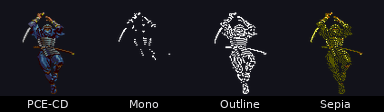

| AC | -4 | HP | 10d6 ≈ 35 | XP | 22,480 | 等級 | 8 |
|---|---|---|---|---|---|---|---|

**戰術**：AC -4 = **戰士命中率 < 20%**。**多重攻擊 + 高斬首機率**。**KATINO 必睡**。

---

### 鬼火 (Will-o-Wisp, ID 29)

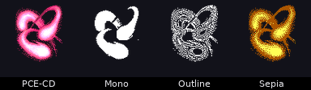

| AC | -8（**全遊戲最高難命中**） | HP | 4d8 ≈ 18（**低**） | XP | 42,880（**B10F 級**） | 等級 | 9 |
|---|---|---|---|---|---|---|---|

**戰術**：**B9F 的 Murphy** ——**HP 超低但 AC 超變態**。
- **法術命中率不受 AC 影響** → **MADALTO / TILTOWAIT 一發秒殺**
- 物理攻擊**命中率 < 10%**——別浪費回合砍
- **XP 4.2 萬** = **單隻給的經驗超過 Vampire**

---

## 六、Tier 5 BOSS ★★★★★（B10F）

### 高階惡魔 (Greater Demon, ID 18)

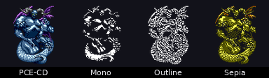

| AC | -3 | HP | 15d8 ≈ 68 | XP | 44,090 | 等級 | 9 |
|---|---|---|---|---|---|---|---|

**戰術**：**會放 MAHAMAN**（隨機強力效果）+ **多重物理攻擊**。
**先 MONTINO 靜默**，然後 **MABADI 砍 HP**。

---

### 吸血鬼領主 (Vampire Lord, ID 20)

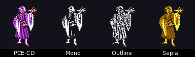

| AC | -3 | HP | 15d8 ≈ 68 | XP | 42,840 | 等級 | 9 |
|---|---|---|---|---|---|---|---|

**戰術**：⚠️ **每擊吸 2–4 等級** ⚠️（**最狠**）
- **ZILWAN** 不一定秒（HP 高 + 抗魔）
- **MABADI 砍到 1d8** → 戰士補刀
- **Werdna 的左右手**

---

### 沃登納 (Werdna, ID 25) ★★★★★

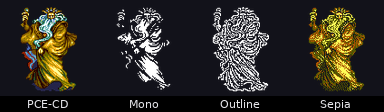

| AC | -7 | HP | 60 | XP | 15,880 | 等級 | 10 |
|---|---|---|---|---|---|---|---|

**戰術**：
- **法術組**：TILTOWAIT、MAHAMAN、MAKANITO、LAKANITO、MALOR
- **必先 MONTINO**——讓他不能 TILTOWAIT
- **MABADI 砍 HP 到 1d8** → 戰士一回合解決
- **隨從**：Vampire Lord × 1 + Vampire × 4 → **第一回合 TILTOWAIT 清掉**

**有趣事實**：Werdna 的 XP **只有 15880**——**跟一個 Arch Mage 一樣**！
Greenberg 設計時可能覺得「**Boss 的價值不在 XP，而在護身符**」。

> **台灣 1985 玩家版本**：「Werdna = **底下那個禿頭老巫師**」。

---

## 七、特殊能力大全

### 等級吸取 (Level Drain) ⚠️⚠️⚠️

| 怪物 | 吸取量 |
|---|---|
| Vampire | 1–2 級 |
| Lifestealer | 1–3 級 |
| Vampire Lord | 2–4 級 |

**永久損失**——**沒有任何咒語可以恢復**。**重新練回經驗值是唯一方法**。

### 麻痺 (Paralyze)

| 怪物 | 觸發 |
|---|---|
| Giant Toad | 舌頭攻擊 |
| Lifestealer | 物理擊中 |

**DIALKO 解除**。

### 斬首 (Critical / Decapitate)

| 怪物 | 機率 |
|---|---|
| Lvl 1 Ninja | 5% |
| High Ninja | 10% |
| Master Ninja | 15% |

**直接秒殺玩家角色**——**屍體可以復活**，但**輕戒裝備易掉**。

### 噴吐 (Breath Weapon)

| 怪物 | 類型 |
|---|---|
| Gas Dragon | 毒氣（群傷 + 中毒） |
| Dragon Zombie | 冷凍 |

**抗火/抗冰裝備**（如 Cold Chain Mail）可減半。

### 群體攻擊咒語

| 咒語 | 怪物 |
|---|---|
| TILTOWAIT | Arch Mage、Werdna |
| MAHAMAN | Greater Demon、Werdna |
| MAHALITO | Lvl 5+ Mage、Bishop |

**MONTINO 靜默是最佳對應**。

---

## 八、PCE-CD 立繪歷史

本專案 v0.4 引入 **55 張 PCE-CD（PC Engine CD）怪物立繪**。歷史背景：

### 1993 PC-Engine CD 版

1993 年，日本 **NAXAT Soft / Game Studio** 在 PC-Engine CD-ROM² 上推出 *Wizardry I*。
這是**全 Wizardry 移植史上第一次**為怪物畫**全彩立繪**——之前的 Apple II / DOS / NES 版
都是文字描述或單色點陣。

PC-Engine CD 版的立繪由 **手塚一郎** 等日本插畫師繪製，風格偏**動漫風**——
跟原版 D&D 風味的「**手冊 black-and-white 線稿**」差異很大。

### CC-BY-SA 授權

PCE-CD 立繪後來被 **wizardry.wiki.gg** 社群以 **CC-BY-SA 4.0** 授權重新發佈。
本專案 v0.4 從該 wiki 抓取了 55 張（**30 個獨特怪物 + 多視角變體**），
**透過 `tools/fetch_pcecd_sprites.sh` 一鍵下載**。

### 為何不用 NES 點陣？

NES 版的怪物只有**單色點陣 32×32**——放在 1280×720 螢幕上**幾乎看不見**。
PCE-CD 是**第一個視覺上可接受的 Wizardry 立繪集**。

### v1.5 全 30 隻視覺驗證

本專案 v1.5 產出 `docs/v15_all_30_sprites.png`——**所有 30 隻怪物**的 in-game 拼貼，
驗證每隻都正確顯示。詳見該截圖。

---

## 九、引用來源

- 本專案 `assets/data/monsters.json`（30 隻怪物中文名與基底數據）
- [Wizardry Wiki (wiki.gg) — Murphy's Ghost](https://wizardry.wiki.gg/wiki/Murphy%27s_Ghost)
- [Wizardry Wiki (wiki.gg) — Werdna](https://wizardry.wiki.gg/wiki/Werdna)
- [tk421.net — Wizardry I Monsters](https://www.tk421.net/wizardry/wiz1monst.shtml)
- [Snafaru — Wizardry 1 Monsters](https://www.zimlab.com/wizardry/recovered/jh/wizardry/monsters.html)
- [Data Driven Gamer — The Bestiary of Wizardry](https://datadrivengamer.blogspot.com/2019/08/the-bestiary-of-wizardry.html)
- [JeffLudwig — Wizardry SNES Rebalancing Mod Monster Lists](https://www.jeffludwig.com/wizardry1-2-3/monsterlist.php)
- [wizardry.wiki.gg — PCE-CD Sprite Gallery](https://wizardry.wiki.gg)
- Sir-tech《Ultimate Wizardry Archives》Manual, 1998 Interplay 再版, p52–55
