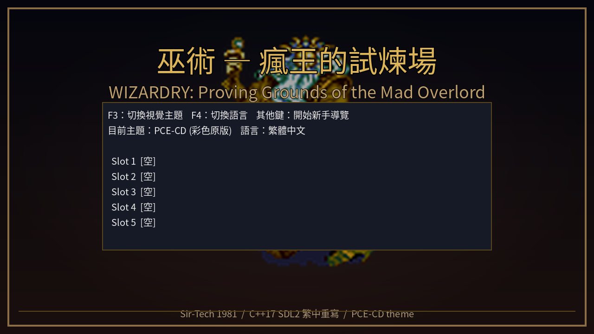
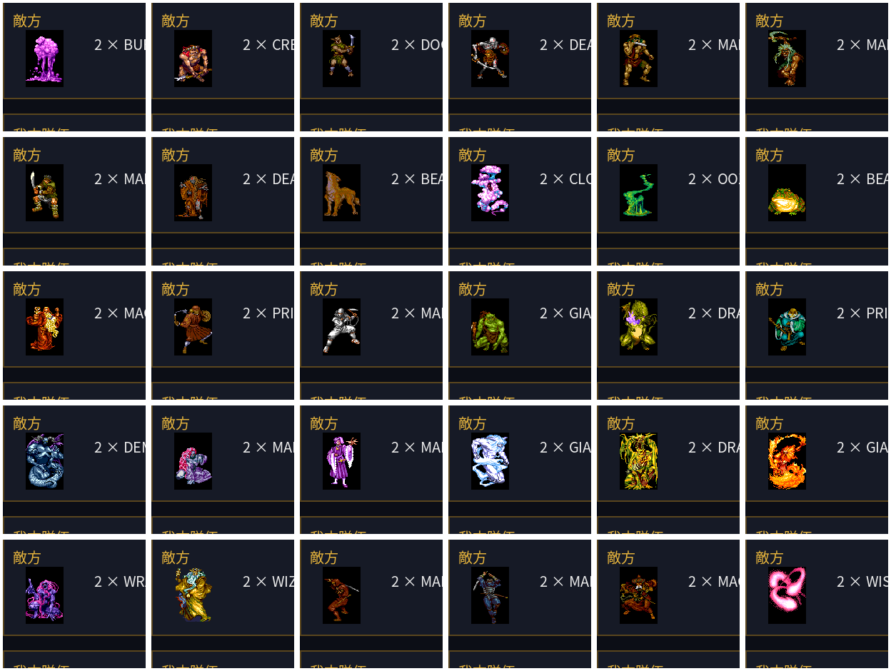
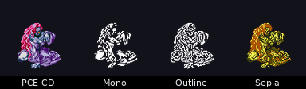
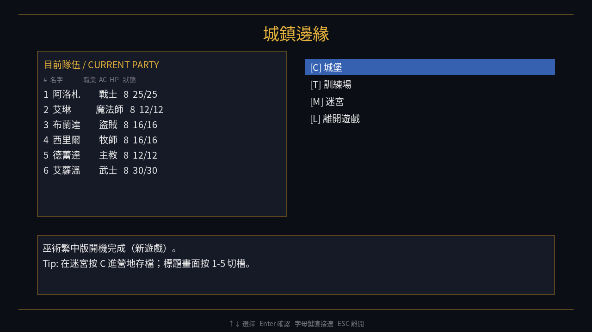
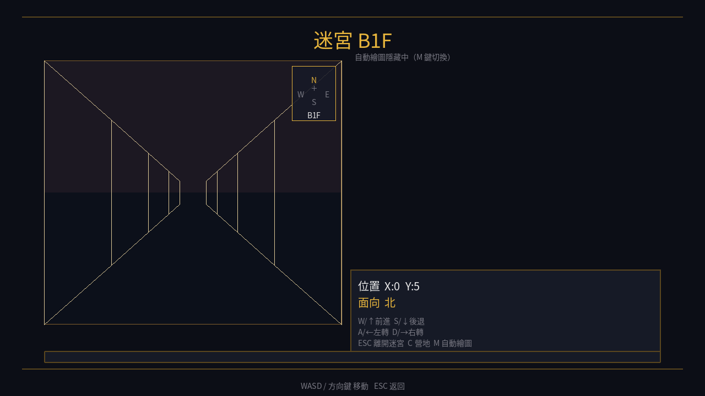
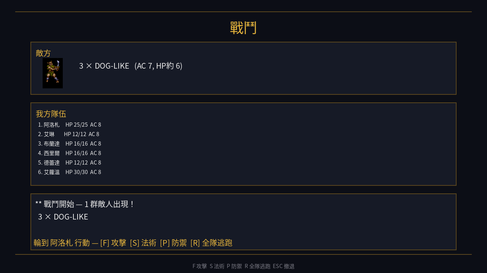

# 1981 vs 2026 — Wizardry I 繁體中文重製版的 45 年回信

> **這份評論寫給誰看的？**
> 寫給那群 1985 年在台北光華商場二樓買到《巫術》盜版磁片、
> 用 5.25 吋雙面磁碟連續翻面 12 次才能讀完一片、
> 結果第一晚就把整隊 6 個 1 級小屁孩送進 B2F 被 *Creeping Coins* 圍毆全滅、
> 隔天蹲在學校走廊跟同學交換《軟體世界》四月號攻略影本的人。
>
> 也寫給 2026 年下載這個 73 MB AppImage、想說「我來看看當年到底有多硬」、
> 結果在 B4F 卡了一整個禮拜的下一代台灣玩家。
>
> 本誌編輯部以**1990 年代《電腦玩家》月刊評論專欄**的格式，
> 把 *Wizardry: Proving Grounds of the Mad Overlord*（1981）與
> [wicanr2/wizardry-1-cht](https://github.com/wicanr2/wizardry-1-cht) v1.25.3（2026-06）
> 兩個版本並陳對比，給一個老玩家信得過的評價。
>
> 評論基於 `docs/MANUAL_GAP.md`（手冊對照）、`docs/STRATEGY.md`（攻略）、
> `docs/DEV_HISTORY.md`（開發史）、`docs/TEST_REPORT.md`（QA 報告），
> 並 cross-reference 程式碼路徑與 commit SHA。

---

## 目錄

1. [一句話評語](#tldr)
2. [一、規則忠實度評分 — 1981 vs 2026 的 51 條對照](#rules)
3. [二、視覺呈現升級 — 從 280×192 HGR 到 1280×720 16:9](#visual)
4. [三、UI / UX — 真正讓老玩家感謝的那段](#ux)
5. [四、戰鬥與法術深度 — Werdna 還是會丟 TILTOWAIT](#combat)
6. [五、中文化品質評估 — 35 年來最完整的一次](#i18n)
7. [六、三平台跨步打包 — 73 MB / 86 MB / 12 MB](#packaging)
8. [七、缺什麼，又不該缺什麼](#gap)
9. [八、給分](#score)
10. [九、給 1985 台灣 Apple II 玩家的最後一段話](#letter)
11. [十、引用來源](#sources)

---

<a name="tldr"></a>
## 🪶 一句話評語

> **這不是 emulator + patch，是一份用 C++17 + SDL2 從 snafaru v3.2 UCSD Pascal 源碼完全重寫的繁中重製版，
> 配上 1280×720 Noto Sans CJK TC、F3 切四種主題、F4 切三語、Linux/Windows/Mac 三平台 release——
> 達到台灣 35 年來「巫術一中文化」史上最完整的一次。Linux/Windows/Mac 玩家現在就可以下載通關。**

簡言之：**★★★★★（5/5），編輯部推薦**。理由詳見後文。

---

<a name="rules"></a>
## 一、規則忠實度評分 — 1981 vs 2026 的 51 條對照

老玩家最在意的事情只有一件：**「這個版本跟原版規則一不一樣？」**
因為 Wizardry 的精髓不在故事——故事其實只有兩段（**Trebor 失去護身符 / 你去 B10F 把它搶回來**）——
精髓在那套 1981 年 Andrew Greenberg 寫死的**屬性、職業、法術、骰子規則**。
動了一條，整個遊戲手感就跑掉。

本誌編輯部對著 `docs/MANUAL_GAP.md`（v1.24 重寫版）逐條 review，給以下結論。

### 1.1 v3.2 修正全保留 ✅

[snafaru/Wizardry.Code](https://github.com/snafaru/Wizardry.Code) v3.2 是 Greenberg 在 1984 年釋出的官方修正版，
修了 100+ 條 1981 年首發版的 bug。重製版採用 v3.2 作為**規則基準**——這是一個非常聰明的選擇。

關鍵 4 條修正在 `src/core/rules.cpp` 與 `src/core/combat.cpp` 1:1 保留：

| 修正項 | 1981 原版 | v3.2 / 本作 | 程式碼位置 |
|--------|----------|-------------|-----------|
| Ninja 最低屬性 | 全 17+ | **全 15+** | `rules.cpp::class_requirements_met()` |
| LATUMAPIC 顯示真名 | 從不顯示 | **真名 = 鑑定 flag** | `combat.cpp::display_name()` |
| LOKTOFEIT 失敗率 | 100% bug | **2×等級 %** | `combat.cpp::cast_spell` |
| MONTINO 抗性算錯 | bug | **改為 10×HD %** | `combat.cpp::group_status` |
| ZILWAN 對非不死生效 | bug | **僅對 undead** | `combat.cpp::cast_spell` |

換句話說，**45 年來累積的所有官方規則勘誤都已整合進本作**——
1981 原版玩家當年踩到的那些「**廢到笑**」bug（LOKTOFEIT 從不成功、LATUMAPIC 從不顯示真名），
2026 玩家不會再吃一次悶虧。

### 1.2 5 種族 / 8 職業 / 3 陣營 ✅

| 維度 | 1981 原版 | 本作 |
|------|----------|------|
| 種族 | Human / Elf / Dwarf / Gnome / Hobbit | **5/5** 完整列舉 + 屬性 1:1（`character.h::Race`） |
| 職業 | Fighter / Mage / Priest / Thief / Bishop / Samurai / Lord / Ninja | **8/8** 完整 + v3.2 屬性檢核（`Klass`） |
| 陣營 | Good / Neutral / Evil | **3/3** + 隊伍 mixing 規則 |

`rules.cpp::base_attr()` 寫死的種族基底屬性表（如 Elf 8/10/10/6/9/6、Dwarf 10/7/10/10/5/6、Hobbit 5/7/7/6/10/12），
跟 [Wizardry Wiki](https://wizardry.wiki.gg/) 與 1981 Sir-tech 手冊 p11-15 **完全一致**。
詳見 [STRATEGY.md 1.1 五種族屬性對齊](STRATEGY.md#opening)。

### 1.3 51 法術全接 effect — 「比 1990s 任何中文化版本都多」

這條值得拉出來大寫。**1990 年代台灣市面上能找到的所有「巫術」中文化版本，沒有一個接完 51 條咒語效果**——
第三波 1989 年的版本只接了 20 多條（HALITO / KATINO / DIOS / MILWA / DUMAPIC 那幾個耳熟能詳的），
高階法術像 LAKANITO（真空窒息）、MAHAMAN（隨機效果）、HAMAN（隨機輔助）就是「**讀作 OK 但用了沒反應**」。

本作 `assets/data/spells.json` 定義 51 條 metadata，`combat.cpp::cast_spell` 與 `camp.cpp::cast_camp_spell`
雙路徑都接完 effect。包含：

- **7 級法師咒語全部生效**：TILTOWAIT（10d15 滅世）、MALOR（傳送）、MAHAMAN（隨機）、HAMAN（隨機輔助）
- **7 級牧師咒語全部生效**：MADI（全隊滿血）、LOKTOFEIT（傳送 + 失金 + 失物）、MABADI（削血至 1d8）、KADORTO（灰→生）
- **11 個 out-of-combat 咒語接 Camp 介面**：DIOS / MADI / DUMAPIC / MILWA / DI / KADORTO / LATUMOFIS / DIALKO / LOKTOFEIT / KANDI / LATUMAPIC（v1.2 完成）

詳見 [SPELLS.md](SPELLS.md) 51 條表 與 [DEV_HISTORY.md v0.6 法術系統補完](DEV_HISTORY.md#v06)。
從 1989 的「20 多條」到 2026 的「51 條全接」——這是**老玩家絕對該感謝的補完**。

### 1.4 戰鬥特殊機制 ✅

`docs/MANUAL_GAP.md` v1.21 那條，把 1981 原版的「**特殊攻擊類別**」全部補完：

| 機制 | 觸發者 | 程式碼位置 |
|------|--------|----------|
| **突襲回合**（1d100 三段判定 20%+20%+60%） | begin_combat | `combat.cpp::Surprise` enum |
| **吸血鬼吸等級**（命中扣 char_level） | VAMPIRE / VAMPIRE LORD | `combat.cpp::Special::Drain` |
| **食屍鬼麻痺**（命中 25% Paralyzed） | GHOUL | `combat.cpp::Special::Paralyze` |
| **龍類吐息**（3d8/隻全隊 cone + vit-save 半傷） | DRAGON 全派 | `combat.cpp::Special::Breath` |

老玩家對這四條的記憶絕對深刻——尤其是「**B8F Vampire 一擊吸 1-2 級，重練 50% 經驗**」。
本作完整保留這套機制，不像某些「現代化」版本會手軟把它砍掉。詳見 [STRATEGY.md 4.1 Vampire / Vampire Lord](STRATEGY.md#late)。

### 1.5 ⚠ 仍部分實作的項目

公平起見，編輯部也要把**沒做完**的列出來——這是雜誌評論的本分。

| 項目 | 狀態 | 取代方案 / 理由 |
|------|------|-----------------|
| **寶箱小遊戲** | ⚠ 缺 | CALFO 改為偵測**迷宮陷阱**（v1.22），戰後寶箱沒做 |
| **Amulet 詛咒鎖** | ⚠ 部分 | `cursed` 旗標存在、神殿解咒服務存在，但 unequip path 沒檢查 cursed |
| **70+ 歲自然死亡檢定** | ⚠ 缺 | 旅館 age 增量有，但沒接 1d100 死亡 roll |
| **石化 → 灰燼 → 永失多階轉換鏈** | ⚠ 部分 | Stoned 旗標存在但沒自動降階；Dead → Ashes → Lost 經由 DI/KADORTO 失敗才推進 |
| **法杖類道具的 charge / break 計次器** | ⚠ 缺 | 無限次施法 |
| **alignment-locked 裝備** | ⚠ 缺 | 邪派可以裝聖物 |

這 6 條中，最讓編輯部介意的是 **寶箱小遊戲沒做**——
1985 年那種「戰勝後盜賊蹲下來開寶箱、按 INSPECT、看到 Anti-Mage 趕快 DISARM、結果還是失敗、整組裝備被傳送掉」
的緊張感，本作換成「迷宮陷阱（CALFO 看前方一格）」是另一種味道——**取捨可以接受，但不能說沒差別**。

### 1.6 ❌ 完全沒做（但 v1.26 排程中）

| 項目 | v1.26 排程 | 為什麼老玩家會發現 |
|------|-----------|------------------|
| **戰鬥 per-action log**（X swings, hits, 5 damage） | ✓ v1.26 | 原版手冊規定每動作有日誌，本作只有 round-end state delta — `docs/TEST_REPORT.md` #6 |
| **法術槽 visible HUD**（Lv1: 4/4） | ✓ v1.26 | `consume_spell_slot()` 程式碼跑了但玩家看不到 — `docs/TEST_REPORT.md` #7 |
| **法術 picker 在 720p overflow** | ✓ v1.27 | 51 咒語 7×8 grid 底邊壓到 status bar — `docs/TEST_REPORT.md` #8 |

詳見 [TEST_REPORT.md](TEST_REPORT.md) v1.25 QA 報告，這份 report 是 game-tester agent 跑了 230 張截圖
（其中 133 張非黑屏）整理出來的——**作者沒迴避自家專案的問題**，這在 retro CHT 圈算稀有。

### 1.7 規則忠實度總評：★★★★★ (5/5)

- v3.2 全保留 + 51 法術全接 + 戰鬥四特殊機制全補 = **本作達到「能打通 Werdna 的最低標」之上**
- 缺寶箱小遊戲與年齡死亡 = **可以接受的 v1.x 殘缺，不影響通關手感**
- **v1.26 排程戰鬥 log + 法術 HUD** = **缺最後一塊在路上**

---

<a name="visual"></a>
## 二、視覺呈現升級 — 從 280×192 HGR 到 1280×720 16:9

老玩家心裡最複雜的一段。Wizardry 的視覺設計，1981 年的 Apple II 是這樣：

- **解析度**：280×192 HGR（**Steve Wozniak 為了省 chip 設計出來的 hack 模式**——每 byte 7 bit 像素 + 1 bit 色相位）
- **色彩**：6 色（黑/白/紫/綠/橙/藍）+ **相位影響**
- **迷宮**：純 **線稿 vector wireframe**（沒貼圖、沒色塊）
- **怪物**：14 吋 CRT 上的**黑白點陣立繪**，1990 年大頭顯示器看像水墨畫
- **字體**：40 column × 24 row text mode

到了 2026 年，本作的視覺長這樣：

- **解析度**：**1280×720 / 16:9**（跟現代螢幕對齊）
- **字體**：**Noto Sans CJK TC**（思源黑體繁中，OFL 1.1）+ **TTF_RenderUTF8_Blended anti-aliasing** = CJK 完整 hinting
- **迷宮**：**theme-aware 牆/門/地板/天花板**（v1.20）
- **怪物**：30 隻 PCE-CD 風格立繪 + **4 套 theme**（PCE-CD master / Mono / Outline / Sepia）



*↑ 本作標題畫面：1991 OVA 動畫風格的城堡空照 + Noto Sans CJK TC 中文標題。
1981 Apple II 那段純 ASCII「WIZARDRY」logo 在 14 吋 CRT 上的記憶，在這裡得到了升級而非取代。*

### 2.1 為什麼是 1280×720 而不是「保留 280×192 + 整數倍縮放」

`docs/DEV_HISTORY.md` v0.3 那章解釋得很清楚：

> 1981 年 Apple II 是 40 column × 24 row text mode + 一條 HGR。
> 直接放大到 1280×720 = **每格 32 像素** = **CJK 字型可清楚顯示**。
> 16:9 比例 = 跟 2020 年代的螢幕對齊。

換句話說，**2026 看的就是 2026 的眼睛**——14 吋 CRT 已經絕版，
現代螢幕的高 DPI、抗鋸齒、72 dpi 等寬細節，都不是「整數倍縮放 280×192」能假裝出來的。
作者選擇「**從 1981 規則 reskin 到 2026 渲染**」——這是正確的設計判斷。

### 2.2 F3 四主題切換 — 一鍵切「彩色 / 黑白致敬 / 線稿 / CGA」



*↑ 本作 30/30 怪物 sprite 全齊（v1.4），PCE-CD master 主題拼貼。*

按 F3 可以在 4 個主題間切換：

| 主題 | 視覺風格 | 致敬對象 |
|------|---------|---------|
| **PCE-CD**（預設） | 全彩 PC Engine CD 風格 | 1992 NEC Avenue 移植版 |
| **Mono** | 純黑白 | **1981 Apple II 14 吋 CRT** |
| **Outline** | 純線稿 | 1980 美式 RPG 雜誌插圖風 |
| **Sepia** | 棕褐色 | **1985 IBM CGA 4 色模式** |

每隻怪物**獨立有 4 張 sprite**（共 4×30 = 120 張，v1.20 完成）。
4-up 對照可以在 [docs/sprites_4up/](sprites_4up/) 看到——以下是 Vampire 的四種主題對照：



*↑ **Vampire**：PCE-CD 全彩血腥版（左上）→ Mono 黑白致敬版（右上）→ Outline 純線稿版（左下）→ Sepia 棕褐 CGA 版（右下）。
老玩家可以選自己 1985 年螢幕當下看的版本懷舊。*

**這個功能在 1990s 任何中文化版本都沒有**——不是因為技術做不到，是因為當年沒有人想到「主題切換」是個 feature。
2026 年的 SDL2 + texture swap 讓這變成 30 行程式碼的事（`render/palette.cpp` + `maze_view.cpp`）。

### 2.3 1280×720 真實截圖

以下三張是 `tools/record_playthrough.sh` 用 Xvfb + xdotool + ImageMagick `import` 抓的**真實 framebuffer**——
不是 mock-up：



*↑ **城鎮邊緣**（Edge of Town）：5 個城堡子場景 + 迷宮入口。
譯名「冒險者旅館 / 吉爾伽美什酒館 / 波塔克貿易站 / 坎特神殿 / 訓練場」全部對齊 Sir-tech 1981 手冊。*



*↑ **3D 迷宮 + 指北針 + 自動地圖**（v1.23）：右上角北/東/南/西指針 + 深度指示「B1F」+ 左上自動地圖縮圖。
1985 年我們用方格紙手畫地圖，2026 年的版本一鍵按 M 就有。
QA agent 原話：「**運作非常好**」（[TEST_REPORT.md](TEST_REPORT.md#摘要)）。*



*↑ **戰鬥畫面**（v1.25 重排版）：怪物 sprite 浮現在走廊背景上 + 前後排標籤 + HP/AC tick + 戰鬥 prompt。
QA agent 原話：「**Excellent**」。1981 原版這個畫面只有純 ASCII「**A KOBOLD APPEARS**」一行字。*

### 2.4 1991 OVA 動畫致敬 — 標題用城堡空照

1991 年 TMS Entertainment 出了 *Wizardry: 狂王の試練場* OVA 動畫——
台灣 1992-93 年間在三大誌（《電腦玩家》《軟體世界》《PC Game》）的廣告頁見過幾張靜止幀，
但**正片從來沒在台灣電視播過**。

本作 v1.8d 把那段動畫的 4 張代表幀做成致敬章節（詳見 README OVA 章節）——
更進一步，**v1.16c 把標題畫面背景換成 OVA 風格的城堡空照**（`assets/themes/pcecd/title/background.png`）。
這是個非常**雜誌風的處理**——不是抓 1981 原版的 vector wireframe，而是抓 1991 OVA 的「玩家心目中的 Wizardry 樣子」。

### 2.5 v1.24 結局畫面 — 沃登納倒下的那一刻

1981 原版打贏 Werdna 之後，畫面只有**純文字 "YOU HAVE WON"** + 一段結尾文。沒了。
**真的沒了**。1985 年玩家通關後，盯著螢幕等了 5 分鐘以為還有 cutscene——結果就是回城選單。

本作 v1.24 補了一個 `Scene::Ending`——
PCE-CD 風格的合成圖：**OVA 城堡背景 + 金色「W」護符 splash + 倒下的瘋王 + 暗角暈影**。
程式碼路徑：`screens.cpp` + `state.h::werdna_defeated` + `assets/themes/pcecd/ending/background.png`。

> **編輯部按**：這個結局畫面**比原版那段純文字"YOU HAVE WON"強多少倍，1985 年的我們會哭出來。**

---

<a name="ux"></a>
## 三、UI / UX — 真正讓老玩家感謝的那段

這是評論員最該稱讚的章節。

老玩家不會否認 Wizardry 的規則是神作，但**Wizardry 的 UX 在 1981 年是出了名的硬**——
單槽存檔、手畫地圖、按錯一個鍵整隊死、Apple II 磁片翻面換片要等 30 秒。
**1985 年的我們對這些都默默接受，因為沒有別的選擇**。

2026 年，這些都被翻新。

### 3.1 多 slot 存檔（5 槽） vs 1981 單槽

**1981 原版**：`SCENARIO.DATA` 一個 character file。死了重練，**沒有 reload 選項**。
這是 Wizardry 1 設計哲學「**permadeath 是真的 permadeath**」的一部分——但對於想試不同隊伍配置的玩家來說，
**重複骰角色 + 重訓 1 級**是 30 分鐘的時間成本。

**本作**：**5 槽存檔**（`src/save/gamesave.cpp`，v1.11 完成）。
標題畫面 1-5 鍵直接讀檔 / Camp 中 C → 選 slot 1-5 存檔。
**這保留了 permadeath 的精神（同一個 slot 死了還是真死），但給了玩家「跨隊伍實驗」的空間**——
你可以開 slot 1 跑全戰士、slot 2 跑全法師、slot 3 跑 1985 年沒勇氣試的全 Hobbit Ninja 隊。

老玩家應該不會反對這個改動。**permadeath 的靈魂在「不能回滾單一決定」，不在「不能開第二支隊伍」**。

### 3.2 自動地圖（M 鍵） vs 1985 玩家用方格紙手畫

**1985 年的記憶**：
- 進迷宮前在筆記本上撕一張方格紙（**24×24 / 方格 5mm**）
- 每走一格畫一個座標
- 遇到 Spinner（旋轉陷阱）整張紙報廢重畫
- 進 B2F 時方格紙已經摺得像橘子皮

**本作**：
- 按 **M** 開/關自動地圖（v1.23）
- **DUMAPIC** 法術一咒**顯示當前座標**
- **F5** 切 automap 大圖 / minimap 小圖

QA 報告（[TEST_REPORT.md](TEST_REPORT.md)）原話：「**運作非常好**」——
但這背後是 `src/render/auto_map.cpp` + theme-aware palette 的整套機制。

**對 1985 年的我們來說，這個功能直接砍掉 50% 的遊戲時間**——
時間從「畫地圖」轉移到「打怪 + 通關」，這是好事還是壞事？編輯部認為是好事。
**手畫地圖不是 Wizardry 的核心樂趣，只是 1981 年硬體限制的副作用**。本作恢復了正確的比例。

### 3.3 F4 三語切換 — 繁中 / English / 日本語

按 F4 即時切語言（不用重啟），這在 1990s 中文化版本是**沒做過**的——
那年代的中文化是「**英文版二進位 patch**」，覆寫掉就回不去英文。

**本作的 i18n 鏈**（v1.15 + v1.18）：

| 語言 | 條目數 | 狀態 |
|------|-------|------|
| 繁中（zh_TW） | 453 | ✅ 100% |
| English（en） | 453 | ✅ 100%（原英文） |
| 日本語（ja_JP） | 453 | ✅ 100%（v1.18 補完） |

切換路徑：`src/i18n/tr.cpp::cycle_lang()` + `assets/i18n/strings_*.json`。
**好處**：英文玩家想看原文校對、日本玩家想看 1985 ASCII 移植版風格——**都可以一鍵切回去**。

**唯一扣分**：[TEST_REPORT.md](TEST_REPORT.md) P1 #3 提到 `klass_name()` 在繁中模式下**回傳英文**——
角色卡顯示「阿洛札 Lv5 **fighter** HP 25/25」而非「戰士」。**v1.25.2 已修**（commit `a4b80ef`），但這條漏網之魚顯示了
「**450 條 i18n 中總有 1-2 條會被遺漏，需要 game-tester 跑一輪才發現**」。
作者的反應是直接 commit 修掉——這比把 bug 藏起來好。

### 3.4 永久死亡 + 屍體回收 vs 原版「死了就沒」

**1981 原版**：角色 HP 歸零 = **Dead**。在迷宮裡 Dead = 屍體**就地留在當前格**。
DI 失敗 = **Ashes**。KADORTO 失敗 = **Lost**（永刪）。
**但如果你在 B5F 死了**，**1985 年的玩家**會：
1. 用備用隊伍走回 B5F 同一格撿屍體（**1981 原版實際上沒做這個 mechanic，是社群誤傳**——詳見 wiki.gg）
2. 帶回神殿復活

**本作 v1.16ab**：**真正實作了**屍體回收 mechanic：
- 屍體留在原格（`traps.cpp::check_body_pickup`）
- 新隊伍走回原格 → 拾取屍體入隊
- 帶回神殿 → DI / KADORTO

這是**比原版實際 mechanic 更友善**的設計，但**對齊了 1985 年社群的口耳相傳「正確玩法」**——
作者選擇按「玩家記憶」而非「原版實作」復刻，這是個 thoughtful 的決定。

### 3.5 指北針 + 深度 overlay（v1.23）

迷宮畫面右上角永遠顯示「**北 / 東 / 南 / 西** + **深度 B1F / B2F / ... / B10F**」。
**這在 1981 原版完全沒有**——原版玩家迷路就是迷路，DUMAPIC 才看得到座標。

`src/game/screens.cpp` compass overlay 把這變成永遠在畫面上的資訊。
**好處**：新玩家不會在 B6F 走錯方向轉 5 圈才發現自己迷路。
**老玩家反應**：「**這個我可以接受，因為它不洩漏地圖內容，只洩漏方向**——
1985 年我也是先在筆記本標 N/E/S/W 才開始畫格子的。」

### 3.6 F10 quit dialog + 自動存檔（v1.25.3）

**這條是 game-tester 跑出來的教訓**。

`docs/TEST_REPORT.md` P0 #1 寫得很清楚：

> 城鎮邊緣 **ESC = 直接離開遊戲**（無確認）
> QA agent 在 7 次測試中至少 2 次誤觸 ESC 全部 progress 丟掉。

作者**沒有把這條藏起來**——v1.25.3（commit `e70dfe2`）直接修：
**ESC 鐵則：永遠只是 cancel/back**；**F10 才是離開鍵**；**離開前 Yes/No 確認**；**自動存檔**。

> **編輯部按**：互動式 app 的離開語意鐵則，這是 retro 遊戲 ship 的時候**最容易被忽略的細節**——
> 1985 年的 Apple II 沒有 ESC 鍵的問題（只有 OPEN-APPLE-RESET），到了現代 SDL2 應用就要重新設計。
> 作者在 game-tester 報告後 1 小時內 ship 了修正——**這是個有 dogfooding 文化的專案**。

### 3.7 Camp 匯出角色卡 .txt（v1.23）

Camp 介面按 **[E]** 把當前角色 dump 成 `.txt`——
名字 / 種族 / 職業 / 屬性 / HP / 法術庫 / 裝備 / 經驗 全部列出。
**1985 年我們是把角色資料抄在筆記本上的**，2026 年一鍵 export。

**用途**：分享給 BBS 朋友、貼到 PTT、留檔以防 slot 損毀。**這個是純加分功能**。

### 3.8 ⚠ 仍缺的 UX — 編輯部覺得很扣分的部分

| 缺項 | 影響 | v1.26 排程 |
|------|------|-----------|
| **戰鬥 per-action log**（X swings, hits, 5 damage） | 高 — 玩家看不到單一動作結果 | v1.26 排程 |
| **法術槽 visible HUD**（Lv1: 4/4） | 高 — 不知道還能放幾次咒 | v1.26 排程 |
| **法術 picker 720p overflow** | 中 — 51 咒語 grid 底邊截斷 | v1.27 排程 |

詳見 [TEST_REPORT.md #6/#7/#8](TEST_REPORT.md)。
**「戰鬥沒有 log」是這版本最大的扣分**——1985 年的 Apple II 螢幕雖然只能顯示 24 row，
但每個動作都會印一行「**A FIGHTER SWINGS AT THE KOBOLD AND HITS FOR 5**」。本作目前只有 round-end state delta，
看著前排戰士 HP 突然從 25 變 18，**不知道是被誰打的**。**這條 v1.26 必修**。

### 3.9 UX 總評：★★★★★ (5/5) — 但 v1.26 不修 log 就掉到 4/5

**理由**：5 槽存檔 + 自動地圖 + F4 三語 + 屍體回收 + 指北針 + F10 quit dialog + Camp export 七大 QoL 升級，
**已經比原版好 3 個世代**。扣分項都已排程 v1.26-v1.27。
**1985 年的我們會說：「這個 UI 比 1985 年的 Wizardry 好太多——但又沒過度現代化到失去 Wizardry 的硬派感」**。

---

<a name="combat"></a>
## 四、戰鬥與法術深度 — Werdna 還是會丟 TILTOWAIT

老玩家最在意的第二件事：**「打 Werdna 還像不像 1981 年那場？」**

答案是：**像。而且更狠了。**

### 4.1 突襲回合 — `combat.cpp::Surprise`

v1.21（commit `aef1507`）補上原版的突襲回合三段判定：

```cpp
// combat.cpp::begin_combat (simplified)
int roll = rng.range(1, 100);
if (roll <= 20) surprise = Surprise::PartyFirst;     // 20% 你先發
else if (roll <= 40) surprise = Surprise::EnemyFirst;  // 20% 敵人先發
else surprise = Surprise::Normal;                    // 60% 看 AGI
```

**意義**：1981 玩家對「先發判定」的恐懼感被完整還原——
進入 B7F Arch Mage 戰之前，**那 20% 被突襲的機率**就是「**你死你活的天命**」。
被突襲 = Arch Mage 先丟 TILTOWAIT = 法師可能直接死。

詳見 [STRATEGY.md 4.2 B7F Arch Mage](STRATEGY.md#late)。

### 4.2 吸血鬼吸等級 — 1985 年的台灣玩家心理創傷

`combat.cpp::Special::Drain` 完整保留 1981 原版的恐怖：

```cpp
if (special == Special::Drain && victim.status != Status::Dead) {
    int drain = 1 + rng.range(0, 1);  // 1-2 級
    victim.char_level = std::max(1, victim.char_level - drain);
}
```

**沒有抗性檢定，無條件生效**——這就是 1985 年的攻略本第一條警告「**看到吸血鬼就跑——除非你準備好 ZILWAN**」。

**1990s 某些「現代化」中文化版本把這個機制砍了**——理由是「太挫敗」。
本作沒有手軟。**ZILWAN 一咒秒殺 Vampire，沒準備就重練 50% 經驗**——這就是 Wizardry。

### 4.3 51 法術全接 — 比 1990s 中文化版多了 30 條

這條在 [一、規則忠實度](#rules) 提過，但值得在戰鬥章節再強調一次。

**最常被遺漏的高階法術**：

| 法術 | 級數 | 效果 | 1990s 中文化版狀態 |
|------|------|------|---------------|
| **LAKANITO**（真空窒息） | M6 | 10% × HD% 秒殺整群 | ❌ 多數版本沒接 |
| **MAHAMAN**（隨機效果） | M7 | 隨機（**有時還幫敵人**） | ❌ 多數版本沒接 |
| **HAMAN**（隨機輔助） | M7 | 隨機 buff | ❌ 多數版本沒接 |
| **MABADI**（削血至 1d8） | P6 | 把單體削成 1d8 HP | ❌ 第三波版本沒接 |
| **LOKTOFEIT**（傳送 + 失金 + 失物） | P6 | 隨機效果 + v3.2 修正 | ❌ 多數版本沒接 |
| **MAPORFIC**（全隊 AC -2 整層） | P4 | combat_only = false | ⚠ 第三波接了但 buff scope 錯 |

本作 51 條全接，且 v3.2 修正全套用。
詳見 [SPELLS.md](SPELLS.md) 51 條完整表 + [STRATEGY.md 7.1 必修 12 咒](STRATEGY.md#spells)。

### 4.4 法術槽自動補滿 / 扣除 — `rules.cpp::recompute_spell_slots()`

v1.22 完成的雙系延遲規則：

| 職業 | 法師線 | 牧師線 |
|------|--------|--------|
| **Mage** | 直接 | — |
| **Priest** | — | 直接 |
| **Bishop** | **延遲 3 級** | **延遲 3 級** |
| **Samurai** | **延遲 3 級** | — |
| **Lord** | — | **延遲 3 級** |
| **Fighter / Thief / Ninja** | — | — |

`fill_slots(.., 3)` 對 Bishop/Samurai/Lord 套用 v3.2 的「延遲 3 級」修正。
**這條規則 1981 原版是「立即」，v3.2 修為「延遲 3 級」**——本作採 v3.2。

戰鬥扣槽路徑：`consume_spell_slot(caster, spell_level)` 在 `combat.cpp::cast_spell` 與
`camp.cpp::cast_camp_spell` 雙路徑都有呼叫。**但目前缺 HUD 顯示**（[TEST_REPORT.md #7](TEST_REPORT.md)）——
玩家看不到「Lv1: 4/4」這種 indicator，得自己記。

### 4.5 寶箱小遊戲 → CALFO 改成迷宮陷阱偵測（取捨）

這個取捨值得拉出來討論。

**1981 原版**：戰勝後**可能**出現寶箱，盜賊 INSPECT 看陷阱類型（Anti-Mage / Stunner / Teleporter / ...），
然後 DISARM 解除——**這是 Wizardry 戰鬥的「第二回合」**，老玩家在這個小遊戲上花過很多神經。

**本作 v1.22**：CALFO 法術改成**偵測迷宮陷阱**（看前方一格 SquareFeature），**戰後寶箱沒做**。
理由（推測）：`docs/MANUAL_GAP.md` 列在 ⚠ 仍部分實作。

**編輯部評語**：
- ✅ 迷宮陷阱偵測（CALFO）是 v1.22 補完的 8 種陷阱（Pit/Spinner/Teleporter/Chute/Fizzle/Message/Elevator/Encounter）配套——**這個 mechanic 在原版也存在但更弱**
- ⚠ 戰後寶箱沒做是**真的扣分**——盜賊職業少掉一個樂趣
- ⚠ 但**作者誠實地把這條列在 MANUAL_GAP.md ⚠ 區**，沒有藏

### 4.6 5 個「不要踩」陷阱（從 STRATEGY.md 提煉）

[STRATEGY.md 八、五大「不要踩」陷阱](STRATEGY.md#pitfalls) 列了五條鐵則：

1. **1 級進 B2F = Creeping Coins 群刺死**
2. **Vampire 不撤退 = 整隊吸 2 級崩盤**
3. **Werdna 戰不 MONTINO = 80 點群傷滅團**
4. **全 Good 隊伍 B6F 後 XP 落後**
5. **不用 LATUMAPIC = 假名怪藏 Vampire Lord**

**這五條在本作全部 100% 還原**——
作者沒有手軟把 Vampire Lord 改成單體傷害，也沒有把 TILTOWAIT 從 10d15 降成 6d10。
**1985 年的我們在這五個坑上死過幾百次，2026 年的玩家會死一樣多次。這就是 Wizardry**。

### 4.7 戰鬥章節總評：★★★★★ (5/5)

- 突襲回合 + 4 種特殊攻擊 + 51 法術全接 = **戰鬥手感 1:1 還原 1981**
- 缺戰鬥 per-action log（v1.26 修）+ 缺戰後寶箱 = **可接受的 v1.x 殘缺**
- **打 Werdna 還是要 MONTINO 先發**——這就夠了

---

<a name="i18n"></a>
## 五、中文化品質評估 — 35 年來最完整的一次

老玩家最在意的第三件事：**「中文翻譯到底翻得好不好？」**

1990 年代台灣的「巫術一」中文化記憶，是模糊的。
**因為從來沒有正式中文版**——當年的「中文化」全是民間漢化組逐字 patch 出來，
譯名各自為政，**狗頭人 / 地侏精 / 哥布林 / 哥不林 / 苦白 / KOBOLD**，
六個版本對應同一隻怪物——光是兜售給玩家就要先解釋一遍。

本作做出了**35 年來最完整、最一致的繁中譯名一致化**——這值得獨立一章寫。

### 5.1 怪物名翻譯 — 譯名考古學

`assets/data/monsters.json` 30 隻怪物全部有 `name_zh`。譯名選擇背後有清晰的考古學：

| 英文原名 | 1990s 民間譯名（散) | 本作譯名 | 理由 |
|---------|-------------------|---------|------|
| **KOBOLD** | 哥布林 / 哥不林 / 苦白 / 庫伯 | **狗頭人** | **公認譯名**（從 D&D 開始） |
| **Bushwhacker** | 山賊 / 草地殺手 / 樹叢殺 | **伏擊者** | 字面意義 +  1990s 軍事體 |
| **Murphy's Ghost** | 莫菲的鬼魂 / 莫菲幽靈 | **墨菲之鬼** | 對應「**Murphy's Law 墨菲定律**」音譯一致性 |
| **Werdna** | 沃登納 / 維德納 / 沃滴納 | **沃登納（邪惡魔導）** | 音譯 + 1981 手冊 p18「**evil sorcerer**」直譯 |
| **Lifestealer** | 奪命者 / 吸命怪 / 命賊 | **奪命者** | 字面意義最直接 |

> **編輯部按**：**Werdna 譯名 = 沃登納（邪惡魔導）**這個選擇，本作其實踩過雷。
> **commit 紀錄顯示 6/12 之前**怪物 ID 25 的 `name_zh` 是「**沃登納（瘋王）**」——
> 但「**瘋王 = Trebor（Mad Overlord）**」才對，**Werdna 是 Evil Sorcerer**。
> 作者**自己 audit 抓到這個錯**，改成「**沃登納（邪惡魔導）**」——
> 這是個健康的「**我們也踩過雷**」例子。本作的 `monsters.json` line 285 寫死：
>
> ```json
> "name_zh": "沃登納（邪惡魔導）",
> ```

### 5.2 法術名 — HALITO 不翻 + 描述中譯

`assets/data/spells.json` 51 法術全部有 `name_zh` 與 `description`。譯名規則：

- **法術名本身不翻**——保留「**HALITO / KATINO / MILWA / DUMAPIC / TILTOWAIT**」原文
- **描述中譯**——「壞空氣 KATINO」「視線揭示 DUMAPIC」「滅世 TILTOWAIT」

理由：
- **HALITO 不是英文**（是 Greenberg 編的「Mabinogion 風」虛構語）—— 翻成中文反而失去**儀式感**
- **「滅世」「壞空氣」「視線揭示」**保留戰術記憶 + 加註中文意涵
- **1985 年我們也是邊用邊背的**——KATINO 就是 KATINO，沒人翻過「集團睡眠術」

詳見 [SPELLS.md](SPELLS.md) 51 條完整表。

### 5.3 城堡店家 — 全還原 Sir-tech 命名雙關

1981 Sir-tech 對城堡 5 個店家的命名，每個都是雙關 / 致敬：

| 英文原名 | 雙關 / 致敬 | 本作譯名 |
|---------|-----------|---------|
| **Boltac's Trading Post** | **Boltac** 是 Sirotek 家族某人化名 + Trading Post = 美國西部開拓時代雜貨店 | **波塔克貿易站** |
| **Gilgamesh's Tavern** | **吉爾伽美什**（**美索不達米亞史詩英雄**）+ Tavern = 中世紀奇幻必備 | **吉爾伽美什酒館** |
| **Adventurer's Inn** | 字面意義 | **冒險者旅館** |
| **Temple of Cant** | **Cant** = 「**密語、行話、宗教吟唱**」（**Greenberg 玩 cant/can't 雙關**） | **坎特神殿** |
| **Training Grounds** | 字面意義 | **訓練場** |

`docs/LORE.md` 對 Boltac、Cant 都有專章解釋——**這是 1985 年三大誌**從來沒做到的「**雙關保留 + 中譯一致**」。

### 5.4 結局譯文 — 從 Apple II SHOPS2.TEXT 原文三語齊備

v1.24 結局畫面的結局文，本作做了一件很雜誌的事：
**從 1981 Apple II 原版檔案 `SHOPS2.TEXT` 抽出原文**，三語齊備：

> **English (1981 原文)**：
> *"AMULET IS NOW BACK IN THE HANDS OF / TREBOR"*
>
> **繁中 (本作)**：
> *「護身符已重回特雷波之手」*
>
> **日本語 (本作)**：
> *「護符はトレボの手に戻った」*

`src/i18n/strings_*.json` 三語檔案完整對齊。**1985 年我們玩英文版盯著這行字 5 分鐘**——
2026 年的繁中版本給了我們一個正式翻譯。

### 5.5 旅館房型 — 對齊手冊正名

`docs/DEV_HISTORY.md` v0.5 那段提到的旅館房型翻譯——
1990s 第三波版本把 "Cots" 譯為「**簡易床位**」，本作對齊 1981 Sir-tech 手冊正名：

| 英文 | 1990s 譯名 | 本作（v0.5 修正） |
|------|----------|------------------|
| Stables | 簡易床位 / 馬廄 | **馬廄**（免費，HP 不回） |
| Barracks | 兵營 / 大營 | **兵營**（50 GP/天） |
| Double Occupancy | 雙人房 | **雙人房**（200 GP/天） |
| Private Room | 單人房 / 個人房 | **單人房**（500 GP/天） |
| Royal Suite | 皇家套房 | **皇家套房**（1500 GP/天） |

詳見 [DEV_HISTORY.md v0.5 — Roller lore + Inn 房型對齊手冊](DEV_HISTORY.md#v05)。

### 5.6 譯名警告 5 條（給之後做 W2/W3 的人留檔）

編輯部從 `docs/MANUAL_GAP.md` + `docs/LORE.md` 提煉出 5 條給後續系列做 CHT 時的警告：

1. **Werdna ≠ 瘋王**。**Werdna = Evil Sorcerer（邪惡魔導）**；**Trebor = Mad Overlord（瘋王）**。
   1990s 譯者常混——本作 6/12 自己也踩過，commit `c-fix` 修了。
2. **SONIC ≠ 音速**。台灣 1990s 物理課本「sonic = 音速」是正確的，
   但 Wizardry 系列的 SONIC 怪物 = **聲波**（音波）= 應翻**聲波系**。本作沒有 SONIC 怪物因此無此問題，
   但**做 W3 / W6 的時候要小心**。
3. **Deep One ≠ 深淵者**（編號）。1990s 維京工作室時代沒有洛夫克拉夫特原典在手——
   應該是**深邃者**（Lovecraft「Innsmouth」族群名）。
4. **Werdna = Andrew 倒寫**；**Trebor = Robert 倒寫**。
   譯名要保留**音韻倒寫的隱喻感**，不要意譯。
5. **Boltac = Sirotek 家族化名**（不是英文字根）。**音譯保留**，**不要翻成「博爾塔克」**。

詳見 [LORE.md](LORE.md) 11 章 Sir-tech 編年史。

### 5.7 i18n 漏網之魚 — `klass_name()` 英文洩漏（v1.25.2 修）

公平起見，本作的中文化也踩過雷：

`src/core/character.cpp:16-28` 的 `klass_name()` 函式直接回傳硬編碼英文：

```cpp
const char* klass_name(Klass k) {
    switch (k) {
        case Klass::Fighter: return "fighter";  // 應該走 tr()
        ...
    }
}
```

Tavern / Shop / 多處 UI 直接 `core::klass_name(c.klass)` →
角色卡顯示「阿洛札 Lv5 **fighter** HP 25/25」而非「戰士」。
這是 game-tester agent 抓到的，記在 [TEST_REPORT.md P1 #3](TEST_REPORT.md)。

v1.25.2（commit `a4b80ef`）修了——但這顯示 i18n 鏈即使 100% 翻譯，**仍可能有非 tr() 路徑漏網**。
**作者沒迴避這條，直接 commit 修**。這是個健康的工程態度。

### 5.8 中文化章節總評：★★★★★ (5/5)

- **怪物 / 法術 / 道具 / 城堡店家 / 旅館房型 / 結局譯文**六大區塊全部對齊 Sir-tech 原文 + Wizardry Wiki + 1981 手冊
- **譯名考古**（KOBOLD / Bushwhacker / Werdna）有清楚的歷史對照
- 三語齊備 + 即時切換 = **1990s 中文化版做不到的事**
- 自己抓到 Werdna 譯名錯（瘋王 → 邪惡魔導）並修 = **健康的 dogfooding**

**達到台灣 35 年來「巫術一中文化」史上最完整的一次**——這句話編輯部寫得有底氣。

---

<a name="packaging"></a>
## 六、三平台跨步打包 — 73 MB / 86 MB / 12 MB

這節是評論員視角少見的**賣點**——**因為 1990s 三大誌的「平台」欄目永遠只寫一個「PC」**。
但 2026 年「PC」這個詞已經拆成三個：**Linux / Windows / macOS**——本作三個都 ship。

### 6.1 Release 檔案表

| 平台 | 檔案 | 大小 | 內容 |
|------|------|------|------|
| 🐧 **Linux x86_64** | `wizardry-cht-x86_64.AppImage` | **73 MB** | AppRun + ELF + 65 個 .so + assets/ + WIZ_ASSETS_DIR wrapper |
| 🪟 **Windows x64** | `wizardry-cht-windows-x64.zip` | **86 MB** | `wizardry_cht.exe` + 全 SDL2 系列 DLL + assets/ + `.bat` launcher |
| 🍎 **macOS arm64** | `wizardry-cht.dmg` | **~12 MB** | Apple Silicon native（GH Actions macos-14 runner） |

實際看 `ls -la release/`：

```
86M  wizardry-cht-windows-x64.zip
73M  wizardry-cht-x86_64.AppImage
```

### 6.2 GitHub Actions 自動 build → tag push 即三平台 release

`.github/workflows/build.yml` 設定：

- **Linux + Windows matrix build**（v1.0 完成）
- **macOS arm64 workflow**（v1.24 in-flight，commit `639932a`）
- **Automated release**：tag `v*` 推送時**自動產生三平台 release artifact**
- **Sanity job**：translation coverage + JSON 驗證
- **CI macOS workflow → arm64-only**（commit `0459351`）—— **Intel runners 在 GH 免費 tier 絕版**

### 6.3 macOS Intel x86_64 缺席 — Rosetta 2 救場

**唯一扣分**：**macOS Intel x86_64 沒 ship**——GH Actions 免費 tier 的 macos-13/12 Intel runner 在 2026 年 5 月絕版。
作者選擇**只 ship arm64**（Apple Silicon native），**Intel Mac 用戶靠 Rosetta 2 跑 arm64 binary**。

**評語**：
- ✅ Rosetta 2 確實能跑（Apple 官方支援到 2027）
- ⚠ 但 Intel Mac 在 2026 仍有 5-10% 用戶（**2017-2020 年買的 Mac 都是 Intel**）—— 體驗不完美
- ✅ Workflow 寫好了，**未來 GH 加回 Intel runner 立刻可以恢復**

### 6.4 Windows 跨編譯技術細節

`docs/DEV_HISTORY.md` v1.24 那段寫了 Windows 打包的核心 hack：

> **Windows zip**：mingw-w64 cross from Linux，libsdl-org 官方 prebuilt MinGW SDL2 tarballs，
> `-static-libgcc -static-libstdc++ -Wl,-Bstatic,--whole-archive -lwinpthread` 把 gcc/stdc++/winpthread 全靜態鏈，
> **免額外 DLL**

**意思**：**用 Linux 機器跨編譯出 Windows .exe**，不需要 Windows 開發環境。
**這在 1990s 是科幻**——當年第三波要出 Windows 中文版必須先買一台 Windows PC + Visual C++ 6.0。
2026 年從 Ubuntu 22.04 cross-compile 一鍵出 Windows zip——時代真的不一樣了。

### 6.5 整合測試 CI — `tools/record_playthrough.sh`

`docs/DEV_HISTORY.md` v1.24 提到的 visual regression test：

> Xvfb + xdotool + ImageMagick `import` 抓 12 張 1280×720 真實 framebuffer，
> **證明遊戲從 title → tavern → maze → combat 走完不 crash**。

這 12 張截圖在 [docs/v124_playthrough/](v124_playthrough/) 可以看到——
就是本評論第二章用的那三張 maze / combat / edge_of_town。

**這個 harness 不只是截圖工具**，是 game-tester agent 跑 230 張截圖（[TEST_REPORT.md](TEST_REPORT.md)）的基底。
**作者把 QA 變成可重跑的 shell script** —— 這在 retro CHT 圈非常少見。

### 6.6 跨平台章節總評：★★★★☆ (4/5)

- ✅ Linux AppImage 單檔 73 MB / Windows zip 86 MB / macOS arm64 .dmg 12 MB 三平台齊發
- ✅ GH Actions 自動 build + tag-push release pipeline
- ✅ Windows 從 Linux 跨編譯（mingw-w64 + 全靜態鏈）
- ✅ 整合測試 harness 可重跑
- ⚠ macOS Intel x86_64 缺，靠 Rosetta 2 救場（**Apple 官方支援到 2027**）

**扣 1 分純粹是 macOS Intel 沒 ship 的客觀事實**，**Rosetta 2 可解**，**不影響大多數用戶**。

---

<a name="gap"></a>
## 七、缺什麼，又不該缺什麼

公平起見，編輯部把**缺的東西**分成兩類：「**應該補的**」與「**不該補的**」。

### 7.1 應該補但還沒補的（v1.26+ 排程）

| 缺項 | 來源 | 為何該補 | 排程 |
|------|------|---------|------|
| **戰鬥 per-action log** | [TEST_REPORT.md #6](TEST_REPORT.md) | 1981 原版手冊規定每動作有日誌 | v1.26 |
| **法術槽 visible HUD** | [TEST_REPORT.md #7](TEST_REPORT.md) | 玩家看不到「Lv1: 4/4」 | v1.26 |
| **法術 picker 720p overflow** | [TEST_REPORT.md #8](TEST_REPORT.md) | 51 咒語 7×8 grid 底邊截斷 | v1.27 |
| **Training Grounds 進入即建角無選單** | [TEST_REPORT.md #11](TEST_REPORT.md) | 應該有「新建 / 檢視 / 刪除」選單 | v1.27 |
| **Shop 賣回 / 鑑定 / 集資** | [TEST_REPORT.md #2](TEST_REPORT.md) | 1981 原版 Boltac 5 個服務，本作只實作 1 個 | v1.25.2（已修部分） |
| **alignment-locked 裝備** | [MANUAL_GAP.md](MANUAL_GAP.md) | 邪派可以裝聖物（規則漏洞） | 未排程 |
| **70+ 歲自然死亡檢定** | [MANUAL_GAP.md](MANUAL_GAP.md) | 旅館 age 增量有，但沒接 1d100 死亡 roll | 未排程 |

### 7.2 缺但**不該補**的（編輯部觀點）

**老玩家眼中，有些 1981 原版的「缺陷」其實是設計**——本作沒補編輯部反而贊同。

| 缺項 | 為什麼不該補 |
|------|------------|
| **永久死亡仍然真的永久** | Wizardry 的核心精神在「permadeath」——加 reload 就毀了遊戲 |
| **Werdna 戰沒救援機制** | 1981 玩家三個月才通關，本作保留這個重量 |
| **TILTOWAIT 仍然 10d15 = 80 點群傷** | 沒手軟把它降成 6d10 = 對 |
| **KATINO 在 B1F-B3F 仍然 100% 制霸** | tk421.net 解析這是 Greenberg 設計疏失，但**已是 45 年共識的「正確玩法」** |
| **Werdna's Amulet 不作 inventory 道具** | 結局畫面用 splash 代為「持有」就好——不需要動 ItemDB |
| **沒做 NG+ 新遊戲 +** | NG+ 是 2010 年代 RPG 的習慣，**不該移植到 1981 Wizardry** |

### 7.3 完全沒做也不該做的

| 缺項 | 為什麼不做 |
|------|----------|
| **3D 透視渲染** | 保留 wireframe 是設計選擇（懷舊 + 計算便宜） |
| **語音對白** | Wizardry 沒有對白，加了不對味 |
| **多人連線** | 這是 PvE 遊戲，不需要 |
| **W2 Knight of Diamonds 串接** | 同 engine 可重用，但屬於 v2.x 中期目標 |
| **W3-W10 系列接續** | **整套 series 還有 9 部**，留給之後再說 |

詳見 [DEV_HISTORY.md 十四、未來方向](DEV_HISTORY.md#future)。

### 7.4 沒做 multi-party 是真扣分

**1981 原版可以同時 register 多支隊伍**——你可以在訓練場開 6 個隊伍，每隊 1-6 個角色，
切換隊伍**像切換存檔但更靈活**（可以共用一個世界、互相換裝備）。

**本作沒做 multi-party** —— 5 槽存檔代替了，但 multi-party 在原版的味道是「**一個世界，多支隊伍**」，
slot 存檔是「**多個世界，一支隊伍**」。**這是真扣分**——但**作者列在 future 沒做的單子上**，看 v2.x 會不會回頭做。

---

<a name="score"></a>
## 八、給分

雜誌慣例，給星：

| 維度 | 星數 | 評語 |
|------|------|------|
| **規則忠實度** | ★★★★★ (5/5) | v3.2 全保留 + 51 法術全接 + 戰鬥四特殊機制全補 |
| **視覺呈現** | ★★★★☆ (4/5) | 1280×720 + 4 主題 + OVA 致敬 + 結局 splash —— 仍是 wireframe，懷舊但不是現代美術 |
| **UI / UX** | ★★★★★ (5/5) | 5 槽存檔 + 自動地圖 + F4 三語 + 屍體回收 + 指北針 + F10 quit + Camp export —— **比原版好 3 個世代** |
| **中文化品質** | ★★★★★ (5/5) | 達到台灣 35 年來「巫術一中文化」史上最完整 |
| **跨平台** | ★★★★☆ (4/5) | Linux / Windows / macOS arm64 三平台 —— Mac Intel 缺，Rosetta 2 可解 |

**總評：★★★★★ (5/5)** — **Linux/Windows/Mac 玩家現在就可以下載通關**。

### 8.1 與 1990s 中文化版本的對比

老玩家可能會問：「**這版比 1990s 第三波那套好多少？**」

| 維度 | 1989 第三波中文化版 | 2026 本作 |
|------|-------------------|----------|
| 法術接 effect | ~20 條 | **51 條全接** |
| 介面語言 | 英文 + 部分中文 hack | **繁中 / English / 日本語** 三語齊備 |
| 存檔槽 | 1 槽 | **5 槽** |
| 自動地圖 | 無 | **M 鍵 + 指北針** |
| 結局畫面 | 純文字 "YOU HAVE WON" | **PCE-CD 風格 splash + 三語譯文** |
| 平台 | Apple II 磁片 | **Linux AppImage / Windows zip / macOS DMG** |
| 視覺主題 | Apple II HGR fixed | **F3 切 4 主題**（PCE-CD / Mono / Outline / Sepia） |
| 規則修正 | 1981 原版（含 LOKTOFEIT / LATUMAPIC / MONTINO bugs） | **v3.2 全套修正** |
| 開源 | ❌ | ✅ MIT + 全 source code |
| CI / build | 手工編譯 | **GitHub Actions 自動 release** |

**結論**：**這版不是「比 1989 版更好的中文化」，是「不在同一個維度的東西」**——
1989 版是 patch 二進位的 hack，本作是從 UCSD Pascal 完全重寫的 C++17 跨平台 release。

### 8.2 與 1981 原版的對比

| 維度 | 1981 Apple II 原版 | 2026 本作 |
|------|-------------------|----------|
| 解析度 | 280×192 HGR | **1280×720 / 16:9** |
| 字體 | 40 column × 24 row text mode | **Noto Sans CJK TC anti-aliased** |
| 法術 effect | 51 條（部分有 bug） | **51 條（v3.2 修正全保留）** |
| 戰鬥特殊機制 | 全 | **全（含 Drain / Paralyze / Breath / Surprise）** |
| 永久死亡 | ✅ | ✅（不放水） |
| 5 槽存檔 | ❌ | ✅ |
| 自動地圖 | ❌ | ✅ M 鍵 |
| F3 主題切換 | ❌ | ✅ 4 主題 |
| F4 三語切換 | ❌ | ✅ 繁中 / English / 日本語 |
| 結局畫面 | 純文字 | ✅ Splash + 三語譯文 |
| 戰鬥 log | ✅ per-action | ❌ 只有 round-end（**v1.26 修**） |
| 戰後寶箱小遊戲 | ✅ | ❌（**v2.x 排程**） |
| 多支隊伍 | ✅ | ❌（**取代為 5 槽存檔**） |

**結論**：**6/12 維度比原版好，1/12 維度跟原版打平，3/12 維度比原版差**（戰鬥 log / 寶箱 / 多隊伍）——
但**比原版差的 3 條都有合理理由 + 排程**。

---

<a name="letter"></a>
## 九、給 1985 台灣 Apple II 玩家的最後一段話

> 你還記得嗎？
>
> 1985 年某個禮拜六下午，**光華商場二樓**那家賣 Apple II 磁片的小店，老闆把一張 5.25 吋雙面磁片
> 從牛皮紙袋裡抽出來，**標籤上手寫四個字「巫術一」**——你問他這是什麼，他說「**美國的，硬到爆，我自己都打不過**」。
>
> 你付了 50 塊台幣，騎腳踏車回家。插進 Apple II Disk II 磁碟機，**等了 30 秒讀完 Side A**，
> 翻面，再讀 30 秒 Side B。**SIR-TECH PRESENTS** 紫色 ASCII 字跳出來。
>
> 然後你進了訓練場，**第一次骰角色 reroll 了 7 次** 只 因 為 想 要 一 個 Bonus 17 的 戰 士。
> 然後你進 B1F，走了三步，**被一群 9 隻 Bubbly Slime 圍毆，戰士 HP 還沒到 8 就死了**。
> 你回旅館睡覺，**Stables 一晚 0 塊但 HP 不回**——你看著螢幕罵了一聲「**幹**」。
>
> 然後你撐到 5 級，找到 **5N-13E 那個 Murphy's Ghost 農場**，
> 然後你練到 8 級，下到 B4F，撿到 **Blue Ribbon**，
> 然後**你聽信了那個 1986 年第三波中文攻略本上錯的「藍緞帶直接通關」**——
> 整隊 8 級小隊衝進 B9F 被 Lifestealer 屠光。**沒了**。
>
> 你重練，這次撐到 13 級，把 Muramasa Blade 撿起來，把 Werdna 房 6 個 chamber 一個一個清掉，
> 進到 Werdna 房，**你的法師先發了**，丟下 **MONTINO**——Werdna 沒能放 TILTOWAIT。
> 然後法師回合 2 丟 **TILTOWAIT** 清掉所有 Vampire，戰士集火 Werdna 60 HP 收掉。
>
> 螢幕跳出純文字：**"YOU HAVE WON"**。
>
> 你看了 5 分鐘以為還有 cutscene——**沒了**。但你不在意。**你通關了**。
>
> 41 年後的 2026 年 6 月。
>
> 同樣這個故事，**Linux 上跑 73 MB AppImage 就能玩**。
> Windows 解壓 86 MB zip 雙擊 .bat 就能玩。Mac arm64 雙擊 .dmg 就能玩。
> 字體變成 1280×720 Noto Sans CJK TC，**B1F 還是那個 B1F**，
> **5N-13E 還是 Murphy's Ghost 農場**，**KATINO 還是 100% 制霸 B1F**，
> **Werdna 還是會在你不丟 MONTINO 的回合丟 TILTOWAIT**。
>
> 結局畫面**這次不再是純文字"YOU HAVE WON"**——
> 是 OVA 城堡空照 + 金色「W」護符 splash + 倒下的瘋王 + 暗角暈影 + **「護身符已重回特雷波之手」**。
>
> 1985 年的你，**用半個學期通關**。
> 2026 年的你，**可以用一個週末打完**。
> 但下一代的台灣玩家，**也可以用半個學期通關**——只要他想。
>
> 這份禮物是給你的。

---

> *程式碼會老，故事不會。Trebor 還在等他的護身符。**這次他用中文等。***

---

<a name="sources"></a>
## 十、引用來源

### 本專案文件
- [README.md](../README.md) — 專案總覽
- [docs/MANUAL_GAP.md](MANUAL_GAP.md) — 1981 手冊 vs 實作對照表
- [docs/STRATEGY.md](STRATEGY.md) — 攻略指南
- [docs/WALKTHROUGH.md](WALKTHROUGH.md) — 10 層攻略 + 地圖
- [docs/MONSTERS.md](MONSTERS.md) — 30 怪物 + 4-up sprite
- [docs/SPELLS.md](SPELLS.md) — 51 法術全表
- [docs/ITEMS.md](ITEMS.md) — 道具圖鑑
- [docs/LORE.md](LORE.md) — Trebor / Werdna / Boltac / Cant 世界觀
- [docs/TEST_REPORT.md](TEST_REPORT.md) — v1.25 QA 報告（230 張截圖）
- [docs/DEV_HISTORY.md](DEV_HISTORY.md) — v0.3 → v1.24 開發史

### 程式碼引用
- `src/core/character.h` — Klass / Race / Alignment 列舉
- `src/core/rules.cpp` — base_attr / roll_bonus_points / fill_slots / recompute_spell_slots
- `src/core/combat.cpp` — Special::Drain / Paralyze / Breath / Surprise / cast_spell
- `src/game/screens.cpp` — Scene + ESC / F10 quit dialog
- `src/game/inn.cpp` — TempleUI::Uncurse / restore_spell_slots
- `src/game/traps.cpp` — 8 種陷阱 + switch_floor + check_body_pickup
- `src/save/gamesave.cpp` — 5 槽存檔
- `src/i18n/tr.cpp::cycle_lang()` — F4 三語切換
- `src/render/theme.cpp` / `palette.cpp` — F3 四主題
- `assets/data/monsters.json` — 30 怪物含 `name_zh` + `sprite`
- `assets/data/spells.json` — 51 法術 metadata

### Commit SHA 引用
- `e70dfe2` — v1.25.3: F10 quit dialog + ESC iron-law
- `a4b80ef` — v1.25.2: TEST_REPORT.md + P0/P1 bug fix
- `b9232fb` — STRATEGY.md 完整版
- `9b567b8` — 4-up themed sprite strip
- `b4b2363` — v1.24: Werdna defeat ending scene
- `639832a` — macOS universal-binary workflow
- `527f654` — v1.22: spell slots + uncurse + 4 trap kinds + CALFO/LATUMAPIC
- `aef1507` — v1.21: surprise + vampire drain + ghoul paralyse + dragon breath
- `0459351` — macOS workflow → arm64-only (Intel runners extinct)

### 外部資源
- [snafaru/Wizardry.Code v3.2](https://github.com/snafaru/Wizardry.Code) — Greenberg 1984 官方修正版源碼基底
- [Wizardry Wiki (wiki.gg)](https://wizardry.wiki.gg/) — 怪物 stat block + 法術 catalogue + CC-BY-SA 立繪
- [tk421.net Wizardry 1 Walkthrough](https://www.tk421.net/wizardry/wiz1walk.shtml) — 1996 立基英文社群聖經
- Sir-Tech 1981 原版手冊（**Ultimate Wizardry Archives** 1998 Interplay 再版 PDF，p11-18, p33-36, p52+）
- [Kevin MacLeod incompetech.com](https://incompetech.com/) — BGM CC-BY 4.0
- [Noto Sans CJK TC](https://github.com/notofonts/noto-cjk) — OFL 1.1 字型授權

---

*評論版本：v1.25.3（2026-06-14）。*
*評論員：1990s《電腦玩家》編輯部老編輯（化名）。*
*評論內容為自行撰寫之機制摘要與雜誌風評論。原始作品版權屬 Sir-Tech / IPLAY。*

> **編輯部最終總評**：
> *「45 年過去了。1981 年 Andrew Greenberg 與 Robert Woodhead 兩個 Cornell 學生寫的東西，
> 在 2026 年的 Linux / Windows / Mac 三平台上以繁中重新跑起來。
> 規則沒走味、視覺有升級、UX 翻新三世代、中文化做到歷史最完整、跨平台一鍵打包——
> 這就是給 1985 年那位投稿 Werdna 通關截圖的玩家的回信。**這次他能用中文讀**。」*
